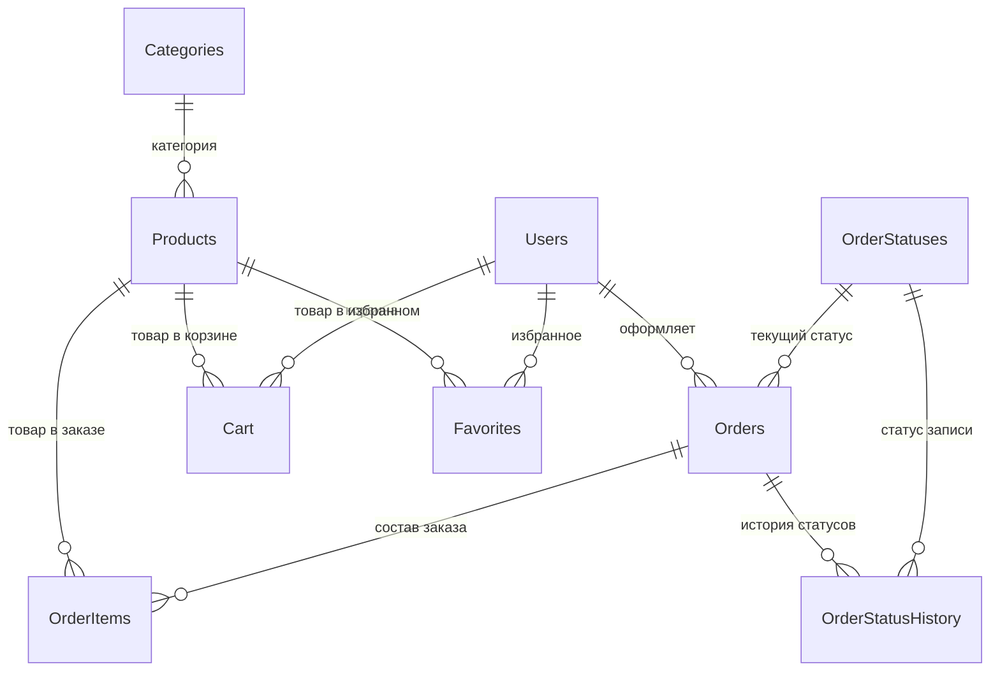

# Модель базы данных TechHaven

> Версия: 3.1 | СУБД: SQLite | Нормальная форма: **3NF**

## ER-диаграмма



## Соглашения

| Правило | Описание |
|---------|----------|
| Даты/время | Хранятся как `TEXT` в формате ISO-8601 (`yyyy-MM-dd HH:mm:ss`) |
| Временнáя зона | Используется `datetime('now','localtime')` — московское время |
| PII-данные | Email и телефон шифруются AES-256-CBC |
| Пароли | Хеш PBKDF2WithHmacSHA256 + соль (формат `salt:hash`) |
| Внешние ключи | Включены через `PRAGMA foreign_keys = ON` |
| Каскадное удаление | Только `OrderItems` при удалении `Orders` |

---

## 1. Categories — Справочник категорий товаров

| Столбец | Тип | Описание |
|---------|-----|----------|
| `id` | INTEGER PK | Уникальный идентификатор категории |
| `name` | TEXT NOT NULL UNIQUE | Название категории (Процессоры, Видеокарты, Мониторы и т.д.) |

**Назначение:** Справочная таблица для нормализации (3NF). Товар ссылается на категорию через `Products.category_id`.

---

## 2. OrderStatuses — Справочник статусов заказов

| Столбец | Тип | Описание |
|---------|-----|----------|
| `id` | INTEGER PK | Уникальный идентификатор статуса |
| `name` | TEXT NOT NULL UNIQUE | Отображаемое название (Новый, В обработке, Подтверждён и т.д.) |
| `sort_order` | INTEGER NOT NULL | Порядок сортировки в UI (0 — первый) |

**Жизненный цикл заказа:**
```
Новый → В обработке → Подтверждён → Собран → Отправлен → Доставлен → Завершён
                                                              ↘ Отменён
```

---

## 3. Users — Пользователи

| Столбец | Тип | Описание |
|---------|-----|----------|
| `id` | INTEGER PK | Уникальный идентификатор пользователя |
| `username` | TEXT NOT NULL | Имя пользователя (3–50 символов) |
| `email` | TEXT NOT NULL UNIQUE | Email (зашифрован AES-256) |
| `phone` | TEXT NOT NULL | Телефон +7XXXXXXXXXX (зашифрован AES-256) |
| `password_hash` | TEXT NOT NULL | Хеш пароля PBKDF2 (формат: `salt:hash`) |
| `role` | TEXT NOT NULL | Роль: `USER` (покупатель) или `ADMIN` |
| `failed_attempts` | INTEGER | Счётчик неудачных попыток входа (brute-force защита, сброс после успешного входа) |
| `lock_until` | TEXT | Дата/время временной блокировки после 5 неудачных попыток |
| `last_login` | TEXT | Дата/время последнего успешного входа |
| `block_reason` | TEXT | Причина блокировки администратором (`NULL` = активен) |
| `created_at` | TEXT | Дата/время регистрации |
| `updated_at` | TEXT | Дата/время последнего обновления профиля |

**Индексы:** `idx_users_email` — ускоряет аутентификацию по email.

---

## 4. Products — Товары

| Столбец | Тип | Описание |
|---------|-----|----------|
| `id` | INTEGER PK | Уникальный идентификатор товара |
| `name` | TEXT NOT NULL | Название товара (уникально) |
| `description` | TEXT | Краткое описание для карточки товара |
| `category_id` | INTEGER NOT NULL FK | Ссылка на `Categories.id` |
| `price` | REAL | Цена товара в рублях (₽) |
| `stock_quantity` | INTEGER | Остаток на складе (шт.). 0 = «Нет в наличии», 1–5 = «Мало», >5 = «В наличии» |
| `specifications` | TEXT | Тех. характеристики (формат: `ключ:значение;ключ:значение`) |
| `image_path` | TEXT | Относительный путь к изображению товара |
| `created_at` | TEXT | Дата/время добавления товара |
| `updated_at` | TEXT | Дата/время последнего изменения |

**Индексы:**
- `idx_products_category` — фильтрация по категории
- `idx_products_name` (UNIQUE) — уникальность названия товара

---

## 5. Orders — Заказы

| Столбец | Тип | Описание |
|---------|-----|----------|
| `id` | INTEGER PK | Уникальный номер заказа |
| `user_id` | INTEGER FK | Ссылка на `Users.id` — кто оформил |
| `order_date` | TEXT | Дата/время оформления заказа |
| `status_id` | INTEGER NOT NULL FK | Ссылка на `OrderStatuses.id` — текущий статус |
| `delivery_address` | TEXT | Адрес доставки (указывает покупатель) |
| `contact_phone` | TEXT | Телефон для связи с курьером |
| `delivery_time_interval` | TEXT | Желаемый интервал доставки (от покупателя, например «10:00–14:00») |
| `comment` | TEXT | Комментарий покупателя к заказу |
| `planned_delivery_date` | TEXT | Фактическая дата доставки (назначает администратор) |
| `planned_delivery_interval` | TEXT | Фактический интервал доставки (назначает администратор) |
| `total_amount` | REAL | Итоговая сумма заказа в рублях (₽) |
| `created_at` | TEXT | Системная дата создания записи |
| `updated_at` | TEXT | Системная дата последнего изменения |

**Индексы:**
- `idx_orders_user` — заказы конкретного пользователя
- `idx_orders_status` — фильтрация по статусу

---

## 6. OrderItems — Позиции заказа

| Столбец | Тип | Описание |
|---------|-----|----------|
| `id` | INTEGER PK | Уникальный идентификатор позиции |
| `order_id` | INTEGER FK | Ссылка на `Orders.id` (ON DELETE CASCADE) |
| `product_id` | INTEGER FK | Ссылка на `Products.id` |
| `quantity` | INTEGER | Количество единиц товара |
| `price_at_order` | REAL | Цена за единицу на момент заказа в рублях (₽) — фиксируется, чтобы изменение цены товара не повлияло на исторические заказы |
| `created_at` | TEXT | Дата/время добавления позиции |

**Индексы:** `idx_orderitems_order` — быстрый доступ к составу заказа.

---

## 7. Cart — Корзина покупателя

| Столбец | Тип | Описание |
|---------|-----|----------|
| `id` | INTEGER PK | Уникальный идентификатор записи |
| `user_id` | INTEGER FK | Ссылка на `Users.id` — чья корзина |
| `product_id` | INTEGER FK | Ссылка на `Products.id` — какой товар |
| `quantity` | INTEGER | Количество единиц (≥ 1, ограничено остатком на складе) |
| `created_at` | TEXT | Дата/время добавления в корзину |
| `updated_at` | TEXT | Дата/время последнего изменения количества |

---

## 8. Favorites — Избранное

| Столбец | Тип | Описание |
|---------|-----|----------|
| `id` | INTEGER PK | Уникальный идентификатор записи |
| `user_id` | INTEGER FK | Ссылка на `Users.id` — чьё избранное |
| `product_id` | INTEGER FK | Ссылка на `Products.id` — какой товар |
| `created_at` | TEXT | Дата/время добавления в избранное |

---

## 9. OrderStatusHistory — История статусов заказов

| Столбец | Тип | Описание |
|---------|-----|----------|
| `id` | INTEGER PK | Уникальный идентификатор записи |
| `order_id` | INTEGER FK | Ссылка на `Orders.id` |
| `status_id` | INTEGER NOT NULL FK | Ссылка на `OrderStatuses.id` — новый статус |
| `changed_at` | TEXT | Дата/время смены статуса |
| `changed_by` | INTEGER | ID пользователя, изменившего статус (администратор) |

**Назначение:** Аудит-лог. Каждая смена статуса заказа фиксируется отдельной записью, что позволяет отслеживать историю обработки заказа и время каждого этапа.

---

## Индексы (сводная таблица)

| Индекс | Таблица | Столбец | Тип | Назначение |
|--------|---------|---------|-----|------------|
| `idx_users_email` | Users | email | INDEX | Быстрый поиск при логине |
| `idx_products_category` | Products | category_id | INDEX | Фильтр по категории |
| `idx_orders_user` | Orders | user_id | INDEX | Заказы пользователя |
| `idx_orders_status` | Orders | status_id | INDEX | Фильтр по статусу |
| `idx_orderitems_order` | OrderItems | order_id | INDEX | Состав заказа |
| `idx_products_name` | Products | name | UNIQUE | Уникальность названия |
