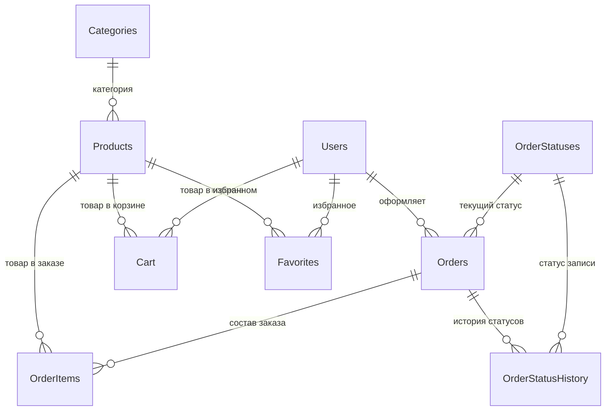

# Модель базы данных DigitalHub

> Версия: 3.3.4 | СУБД: SQLite 3 (`org.xerial:sqlite-jdbc:3.42.0.0`) | Нормальная форма: **3NF**
>
> Источник DDL: `src/main/resources/schema.sql` (читается в `DatabaseManager.initializeDatabase()` через `loadResource("/schema.sql")`).
> Программное сидирование (категории, статусы, 500 товаров, 11 пользователей, 170 заказов) — `config/DatabaseManager.java` и `config/SeedProducts.java`.

## ER-диаграмма



## Соглашения

| Правило | Описание |
|---------|----------|
| Даты/время | Хранятся как `TEXT` в формате ISO-8601 (`yyyy-MM-dd HH:mm:ss`) |
| Временнáя зона | DEFAULT-значения — `datetime('now')` (UTC); пользовательские поля (`order_date`, история статусов) пишутся в локальной зоне приложения |
| PII-данные | Email, телефон пользователя, контактный телефон заказа и `delivery_address` шифруются AES-256-CBC (`SecurityManager.encrypt/decrypt`) |
| Пароли | Хеш PBKDF2WithHmacSHA256, 100 000 итераций, 16-байт соль; формат хранения `salt:hash` (Base64) |
| Внешние ключи | Включены через `PRAGMA foreign_keys = ON` при каждом `getConnection()` |
| Каскадное удаление | Только `OrderItems` при удалении `Orders` (`ON DELETE CASCADE`); остальные FK без каскада |
| Транзакции оформления заказа | `OrderService.placeOrder` оборачивает создание заказа, позиций, атомарное списание стока, запись истории и очистку корзины в **одну** транзакцию (`setAutoCommit(false)` + `commit/rollback`) |
| Код получения заказа | Отдельного столбца нет: восьмизначный цифровой код формируется из `Orders.id`, штрих-код Code 128-C строится из этого кода; дата и сумма берутся из `Orders.order_date` и `Orders.total_amount` |
| Выдача заказа | `OrderService.issueOrderByReceiptCode` ищет заказ по коду получения, переводит заказ из `Доставлен` в `Выдан` и добавляет запись в `OrderStatusHistory`; для остальных статусов возвращает ошибку, новые таблицы не требуются |
| Защита остатков | `ProductRepository.decrementStock(conn, productId, qty)` — атомарный `UPDATE Products SET stock_quantity = stock_quantity - ? WHERE id = ? AND stock_quantity >= ?`; возвращает `false` при гонке, инициируя rollback всей транзакции |
| CHECK-constraints | `Products.price ≥ 0`, `Products.stock_quantity ≥ 0`, `Orders.total_amount ≥ 0`, `OrderItems.quantity > 0`, `OrderItems.price_at_order ≥ 0`, `Cart.quantity > 0` — гарантия неотрицательных значений и положительного количества на уровне БД |
| Идемпотентное сидирование | Справочники, товары, пользователи — `INSERT OR IGNORE`; перед созданием UNIQUE-индексов на `Cart`/`Favorites` выполняется dedup `DELETE WHERE id NOT IN (SELECT MIN(id) GROUP BY user_id, product_id)` — безопасная миграция существующих БД |
| Изоляция тестовой БД | Surefire передаёт `-Ddb.path=${project.build.directory}/test.db` — интеграционные тесты пишут в `target/test.db`, а не в production `digitalhub.db` |

---

## 1. Categories — Справочник категорий товаров

| Столбец | Тип | Описание |
|---------|-----|----------|
| `id` | INTEGER PK AUTOINCREMENT | Уникальный идентификатор категории |
| `name` | TEXT NOT NULL UNIQUE | Название категории |

**Назначение:** Справочная таблица для нормализации (3NF). Товар ссылается на категорию через `Products.category_id`.

**Содержимое (11 записей, порядок вставки в `DatabaseManager.seedCategories()`):**

| `name` |
|---|
| Процессоры |
| Видеокарты |
| Оперативная память |
| Накопители |
| Материнские платы |
| Блоки питания |
| Охлаждение |
| Корпуса |
| Мониторы |
| Периферия |
| Сетевое оборудование |

---

## 2. OrderStatuses — Справочник статусов заказов

| Столбец | Тип | Описание |
|---------|-----|----------|
| `id` | INTEGER PK AUTOINCREMENT | Уникальный идентификатор статуса |
| `name` | TEXT NOT NULL UNIQUE | Отображаемое название (на русском) |
| `sort_order` | INTEGER NOT NULL DEFAULT 0 | Порядок сортировки в UI (1 — первый) |

**Содержимое (9 записей, `DatabaseManager.seedOrderStatuses()`):**

| `sort_order` | `name` |
|---:|---|
| 1 | Новый |
| 2 | В обработке |
| 3 | Подтверждён |
| 4 | Собран |
| 5 | Отправлен |
| 6 | Доставлен |
| 7 | Выдан |
| 8 | Завершён |
| 9 | Отменён |

**Жизненный цикл заказа:**
```
Новый → В обработке → Подтверждён → Собран → Отправлен → Доставлен → Выдан → Завершён
                                                              ↘ Отменён
```
Каждая смена статуса фиксируется отдельной записью в `OrderStatusHistory`.

---

## 3. Users — Пользователи

| Столбец | Тип | Описание |
|---------|-----|----------|
| `id` | INTEGER PK AUTOINCREMENT | Уникальный идентификатор пользователя |
| `username` | TEXT NOT NULL | Имя пользователя (3–50 символов; валидация в `SecurityManager.validateUsername`) |
| `email` | TEXT NOT NULL UNIQUE | Email — хранится **зашифрованным** AES-256, перед поиском нормализуется в lowercase |
| `phone` | TEXT NOT NULL | Телефон в формате `+7XXXXXXXXXX` — хранится **зашифрованным** AES-256 |
| `password_hash` | TEXT NOT NULL | Хеш пароля PBKDF2WithHmacSHA256 (формат: `salt:hash`) |
| `role` | TEXT NOT NULL DEFAULT `'USER'` | Роль: `USER` (покупатель) или `ADMIN` |
| `failed_attempts` | INTEGER DEFAULT 0 | Счётчик неудачных попыток входа (сброс после успешного входа) |
| `lock_until` | TEXT NULL | Дата/время временной блокировки (после 5 неудачных попыток — на 5 минут, см. `AuthService`) |
| `last_login` | TEXT NULL | Дата/время последнего успешного входа |
| `block_reason` | TEXT NULL | Причина блокировки администратором (`NULL` = активен; устанавливается из `AdminUsersView` / `UserService.lockUser`) |
| `created_at` | TEXT DEFAULT `datetime('now')` | Дата/время регистрации |
| `updated_at` | TEXT DEFAULT `datetime('now')` | Дата/время последнего обновления профиля |

**Индексы:** `idx_users_email` — ускоряет аутентификацию по email (поиск по зашифрованному значению).

---

## 4. Products — Товары

| Столбец | Тип | Описание |
|---------|-----|----------|
| `id` | INTEGER PK AUTOINCREMENT | Уникальный идентификатор товара |
| `name` | TEXT NOT NULL | Название товара (см. UNIQUE-индекс `idx_products_name`) |
| `description` | TEXT NULL | Краткое описание для карточки товара |
| `category_id` | INTEGER NOT NULL REFERENCES `Categories(id)` | Внешний ключ на справочник категорий |
| `price` | REAL CHECK (`price IS NULL OR price >= 0`) | Цена товара в рублях (₽), не может быть отрицательной |
| `stock_quantity` | INTEGER DEFAULT 0 CHECK (`stock_quantity >= 0`) | Остаток на складе (шт.), не уходит в минус. 0 = «Нет в наличии», 1–5 = «Мало», >5 = «В наличии» |
| `specifications` | TEXT NULL | Тех. характеристики (формат: `ключ:значение;ключ:значение`) |
| `image_path` | TEXT NULL | Относительный путь к изображению товара (резолвится через `AppPaths.productImagesDir()`) |
| `created_at` | TEXT DEFAULT `datetime('now')` | Дата/время добавления товара |
| `updated_at` | TEXT DEFAULT `datetime('now')` | Дата/время последнего изменения |

**Индексы:**
- `idx_products_category` — фильтрация по категории
- `idx_products_name` (UNIQUE) — уникальность названия товара

---

## 5. Orders — Заказы

| Столбец | Тип | Описание |
|---------|-----|----------|
| `id` | INTEGER PK AUTOINCREMENT | Уникальный номер заказа |
| `user_id` | INTEGER NULL FK → `Users(id)` | Кто оформил (без каскада) |
| `order_date` | TEXT DEFAULT `datetime('now')` | Дата/время оформления заказа |
| `status_id` | INTEGER NOT NULL REFERENCES `OrderStatuses(id)` | Текущий статус |
| `delivery_address` | TEXT NULL | Адрес доставки (хранится **зашифрованным** AES-256) |
| `contact_phone` | TEXT NULL | Телефон для связи с курьером (хранится **зашифрованным** AES-256) |
| `delivery_time_interval` | TEXT NULL | Желаемый интервал доставки от покупателя (`«дата + временной слот»`) |
| `comment` | TEXT NULL | Комментарий покупателя к заказу |
| `planned_delivery_date` | TEXT NULL | Фактическая дата доставки (назначает администратор) |
| `planned_delivery_interval` | TEXT NULL | Фактический интервал доставки (назначает администратор) |
| `total_amount` | REAL CHECK (`total_amount IS NULL OR total_amount >= 0`) | Итоговая сумма заказа в рублях (₽), не может быть отрицательной |
| `created_at` | TEXT DEFAULT `datetime('now')` | Системная дата создания записи |
| `updated_at` | TEXT DEFAULT `datetime('now')` | Системная дата последнего изменения |

**Индексы:**
- `idx_orders_user` — заказы конкретного пользователя
- `idx_orders_status` — фильтрация по статусу

**Данные для получения заказа:** экран оформления и раздел «Мои заказы» показывают покупателю штрих-код Code 128-C, цифровой код, дату оформления и сумму заказа. Новые поля в таблицу не добавляются: цифровой код — это форматированный `id`, дата и сумма уже хранятся в `order_date` и `total_amount`.

---

## 6. OrderItems — Позиции заказа

| Столбец | Тип | Описание |
|---------|-----|----------|
| `id` | INTEGER PK AUTOINCREMENT | Уникальный идентификатор позиции |
| `order_id` | INTEGER NULL FK → `Orders(id)` | Ссылка на заказ; **ON DELETE CASCADE** — позиции удаляются вместе с заказом |
| `product_id` | INTEGER NULL FK → `Products(id)` | Ссылка на товар (без каскада — товар не удаляется автоматически) |
| `quantity` | INTEGER CHECK (`quantity IS NULL OR quantity > 0`) | Количество единиц товара (только положительное) |
| `price_at_order` | REAL CHECK (`price_at_order IS NULL OR price_at_order >= 0`) | Цена за единицу на момент заказа в рублях (₽) — фиксируется, чтобы изменение цены товара не повлияло на исторические заказы |
| `created_at` | TEXT DEFAULT `datetime('now')` | Дата/время добавления позиции |

**Индексы:** `idx_orderitems_order` — быстрый доступ к составу заказа.

---

## 7. Cart — Корзина покупателя

| Столбец | Тип | Описание |
|---------|-----|----------|
| `id` | INTEGER PK AUTOINCREMENT | Уникальный идентификатор записи |
| `user_id` | INTEGER NULL FK → `Users(id)` | Чья корзина |
| `product_id` | INTEGER NULL FK → `Products(id)` | Какой товар |
| `quantity` | INTEGER DEFAULT 1 CHECK (`quantity > 0`) | Количество единиц (≥ 1, в UI ограничено остатком на складе) |
| `created_at` | TEXT DEFAULT `datetime('now')` | Дата/время добавления в корзину |
| `updated_at` | TEXT DEFAULT `datetime('now')` | Дата/время последнего изменения количества |

**Индексы:** `idx_cart_user_product` (UNIQUE) — пара `(user_id, product_id)` уникальна; защита от логических дублей. При повторном добавлении того же товара `CartRepository.addToCart` суммирует количество в существующей записи.

---

## 8. Favorites — Избранное

| Столбец | Тип | Описание |
|---------|-----|----------|
| `id` | INTEGER PK AUTOINCREMENT | Уникальный идентификатор записи |
| `user_id` | INTEGER NULL FK → `Users(id)` | Чьё избранное |
| `product_id` | INTEGER NULL FK → `Products(id)` | Какой товар |
| `created_at` | TEXT DEFAULT `datetime('now')` | Дата/время добавления в избранное |

**Индексы:** `idx_favorites_user_product` (UNIQUE) — пара `(user_id, product_id)` уникальна.

---

## 9. OrderStatusHistory — История статусов заказов

| Столбец | Тип | Описание |
|---------|-----|----------|
| `id` | INTEGER PK AUTOINCREMENT | Уникальный идентификатор записи |
| `order_id` | INTEGER NULL FK → `Orders(id)` | Какой заказ |
| `status_id` | INTEGER NOT NULL REFERENCES `OrderStatuses(id)` | Новый статус |
| `changed_at` | TEXT DEFAULT `datetime('now')` | Дата/время смены статуса |
| `changed_by` | INTEGER NULL | ID пользователя, изменившего статус (обычно администратор; для USER-инициированной отмены — id покупателя) |

**Назначение:** Аудит-лог. Каждая смена статуса заказа фиксируется отдельной записью, что позволяет отслеживать историю обработки заказа и время каждого этапа. Используется в `OrdersView` для построения прогресс-трекера и в `AdminOrdersView` для детального просмотра.

---

## Индексы (сводная таблица)

| Индекс | Таблица | Столбец | Тип | Назначение |
|--------|---------|---------|-----|------------|
| `idx_users_email` | Users | email | INDEX | Быстрый поиск при логине |
| `idx_products_category` | Products | category_id | INDEX | Фильтр по категории |
| `idx_orders_user` | Orders | user_id | INDEX | Заказы пользователя |
| `idx_orders_status` | Orders | status_id | INDEX | Фильтр по статусу |
| `idx_orderitems_order` | OrderItems | order_id | INDEX | Состав заказа |
| `idx_products_name` | Products | name | UNIQUE | Уникальность названия |
| `idx_cart_user_product` | Cart | (user_id, product_id) | UNIQUE | Один товар у пользователя = одна запись в корзине |
| `idx_favorites_user_product` | Favorites | (user_id, product_id) | UNIQUE | Один товар у пользователя = одна запись в избранном |
