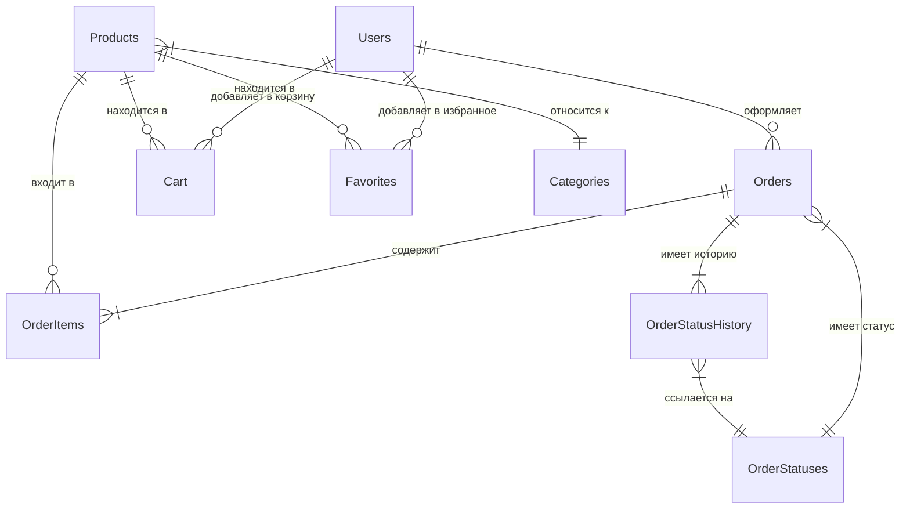
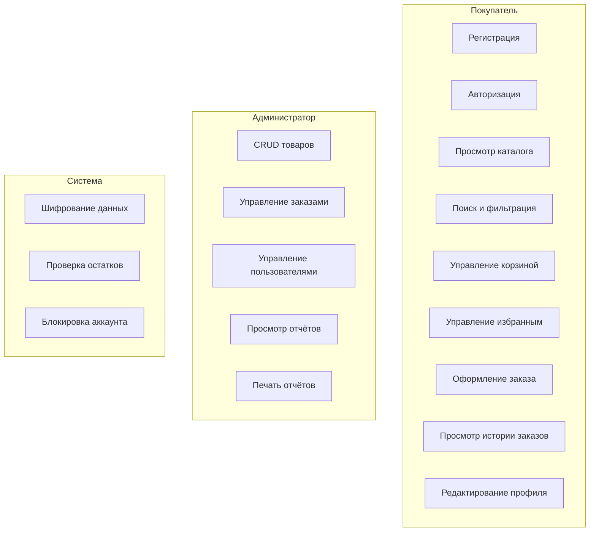
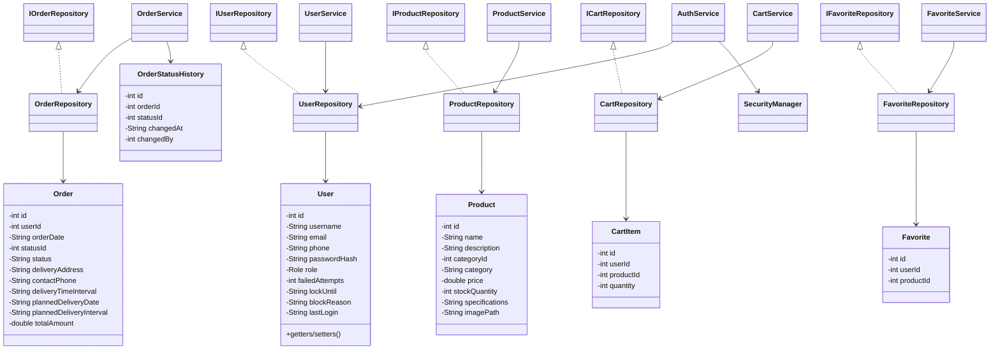
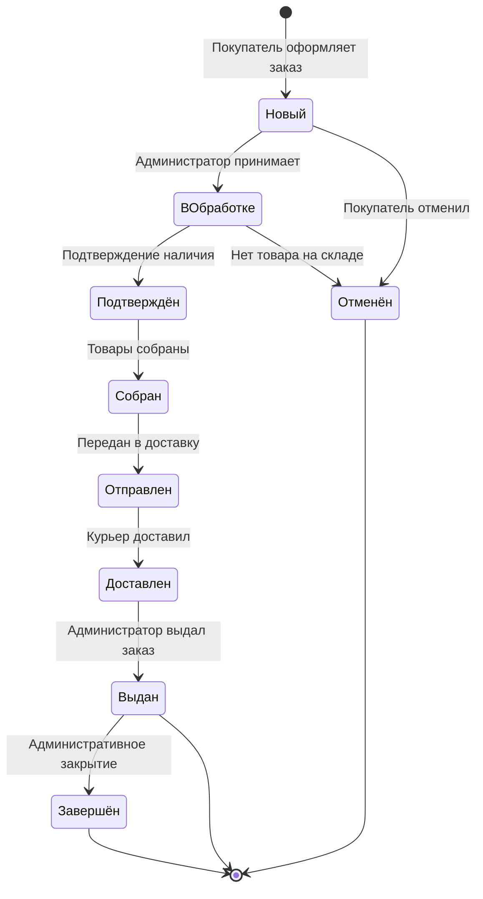
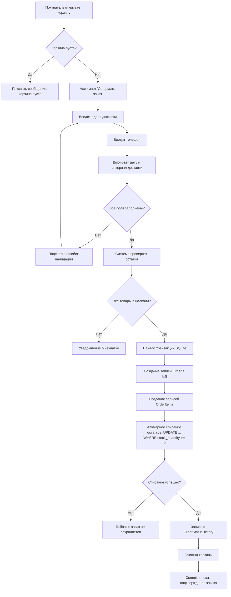
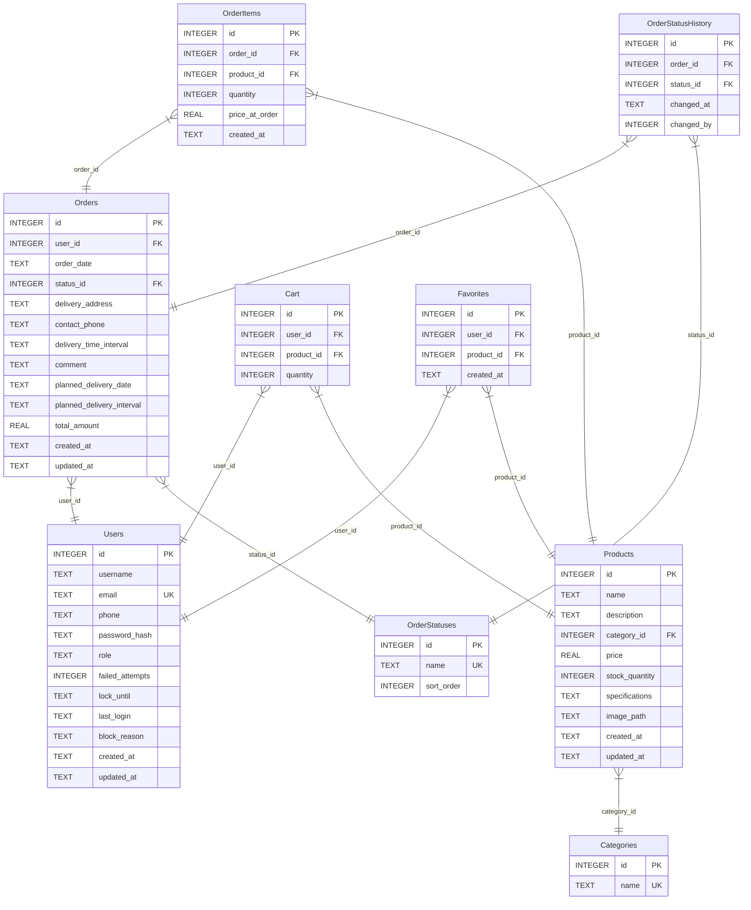

# ПОЯСНИТЕЛЬНАЯ ЗАПИСКА

## к дипломной работе на тему:

## «Разработка автономного desktop-приложения по продаже компьютерного оборудования DigitalHub»

---

**ДЕПАРТАМЕНТ ОБРАЗОВАНИЯ И НАУКИ ГОРОДА МОСКВЫ**

**ГОСУДАРСТВЕННОЕ БЮДЖЕТНОЕ ПРОФЕССИОНАЛЬНОЕ ОБРАЗОВАТЕЛЬНОЕ УЧРЕЖДЕНИЕ ГОРОДА МОСКВЫ «КОЛЛЕДЖ СОВРЕМЕННЫХ ТЕХНОЛОГИЙ имени Героя Советского Союза М.Ф. Панова»**

---

Допустить к защите

Заместитель директора ______________ А.В. Гаврилова

«___» __________________ 2026 года

---

### ДИПЛОМНАЯ РАБОТА

**Специальность:** 09.02.07 Информационные системы и программирование

**Тема:** «Разработка автономного desktop-приложения по продаже компьютерного оборудования DigitalHub»

**Выполнил:** студент группы _________

ФИО: _________________________________

**Руководитель:** _________________________________

Дата: «___» __________________ 2026 г.

Подпись: ______________

**Москва, 2026**

---

*Страница для задания на дипломную работу — вшивается после титульного листа, выдаётся руководителем*

---

## ОГЛАВЛЕНИЕ

- ОБОЗНАЧЕНИЯ И СОКРАЩЕНИЯ
- ВВЕДЕНИЕ
- ГЛАВА 1. АНАЛИЗ ПРЕДМЕТНОЙ ОБЛАСТИ И ТРЕБОВАНИЙ К ИНФОРМАЦИОННОЙ СИСТЕМЕ
  - 1.1. Статистический анализ предметной области
  - 1.2. Характеристика организации
  - 1.3. Информация о предметной области
  - 1.4. Анализ проблем
  - 1.5. Требования заказчика к информационной системе
  - 1.6. Определение путей устранения узких мест
  - 1.7. Выбор варианта автоматизации
  - 1.8. Анализ аналогов на рынке
  - 1.9. Генерируемые отчёты
- ГЛАВА 2. ПРОЕКТИРОВАНИЕ И РАЗРАБОТКА ИНФОРМАЦИОННОЙ СИСТЕМЫ
  - 2.1. Нормативно-правовая база
  - 2.2. Концепция разработки информационной системы
  - 2.3. Технология и методология проектирования по ГОСТ 34.601
  - 2.4. Обоснование средств реализации
  - 2.5. Диаграммы и схемы программного обеспечения
  - 2.6. Графический пользовательский интерфейс
  - 2.7. Разработка таблиц информационной системы
  - 2.8. Разработка запросов информационной системы
  - 2.9. Разработка отчётов информационной системы
  - 2.10. Тестирование информационной системы
- ГЛАВА 3. ОХРАНА ТРУДА И ТЕХНИКА БЕЗОПАСНОСТИ
  - 3.1. Требования безопасности перед началом работы
  - 3.2. Требования безопасности во время выполнения работы
  - 3.3. Требования безопасности после окончания работы
  - 3.4. Требования безопасности в аварийных ситуациях
- ГЛАВА 4. РАСЧЁТ СТОИМОСТИ РАЗРАБОТКИ
  - 4.1. Определение разработчиков и распределение обязанностей
  - 4.2. Диаграмма Ганта
  - 4.3. Расчёт стоимости проекта
- ЗАКЛЮЧЕНИЕ
- СПИСОК ИСПОЛЬЗОВАННЫХ ИСТОЧНИКОВ
- ПРИЛОЖЕНИЯ

---

## ОБОЗНАЧЕНИЯ И СОКРАЩЕНИЯ

АИС — автоматизированная информационная система
АРМ — автоматизированное рабочее место
БД — база данных
ИС — информационная система
ИТ — информационные технологии
ОС — операционная система
ПО — программное обеспечение
ПП — программный продукт
СУБД — система управления базами данных
СЭТ — специализированная электронная торговля
ТЗ — техническое задание
AES — Advanced Encryption Standard (стандарт шифрования данных)
API — Application Programming Interface (программный интерфейс)
CRUD — Create, Read, Update, Delete (операции создания, чтения, обновления, удаления)
CSS — Cascading Style Sheets (каскадные таблицы стилей)
FAT JAR — исполняемый JAR-архив со всеми зависимостями приложения
JDBC — Java Database Connectivity (технология доступа к БД из Java)
JDK — Java Development Kit (набор инструментов разработки Java)
JRE — Java Runtime Environment (среда исполнения Java)
MVVM — Model-View-ViewModel (архитектурный паттерн)
PBKDF2 — Password-Based Key Derivation Function 2 (функция формирования ключа на основе пароля)
PII — Personally Identifiable Information (персональные данные)
SQL — Structured Query Language (язык структурированных запросов)
UML — Unified Modeling Language (унифицированный язык моделирования)
UI — User Interface (пользовательский интерфейс)

---

## ВВЕДЕНИЕ

### Актуальность темы

Рынок компьютерного оборудования в России демонстрирует устойчивый рост. По данным аналитической компании GfK и исследования IDC, объём розничных продаж компьютерной техники и комплектующих в Российской Федерации составил 1,12 трлн рублей в 2024 году, увеличившись на 18% по сравнению с 2023 годом [1]. Несмотря на развитие крупных маркетплейсов, значительная доля продаж по-прежнему приходится на специализированные офлайн-магазины: по данным Data Insight, в 2024 году более 42% покупателей компьютерного оборудования предпочитали приобретать технику в физических торговых точках, где можно получить консультацию и увидеть товар [2].

При этом малые и средние магазины компьютерной техники испытывают серьёзные затруднения с автоматизацией. По результатам опроса, проведённого порталом Retail.ru в 2024 году среди 430 розничных предприятий Москвы и Московской области, 57% небольших магазинов электроники ведут учёт товаров вручную или в электронных таблицах, 31% используют бесплатные POS-системы с ограниченным функционалом, и лишь 12% применяют полноценные системы управления торговлей [3].

*Рис. 1 — Способы ведения учёта в малых магазинах электроники (по данным Retail.ru, 2024)*

| Способ учёта | Доля магазинов |
|---|---|
| Ручной учёт / Excel | 57% |
| Бесплатные POS-системы | 31% |
| Полноценные системы (1С и др.) | 12% |

*Рис. 2 — Динамика объёма рынка компьютерного оборудования в РФ, млрд руб.*

| Год | Объём, млрд руб. | Рост, % |
|---|---|---|
| 2021 | 780 | — |
| 2022 | 830 | +6,4% |
| 2023 | 950 | +14,5% |
| 2024 | 1120 | +17,9% |

*Рис. 3 — Причины отказа от автоматизации в малых магазинах электроники*

| Причина | Доля ответов |
|---|---|
| Высокая стоимость лицензий | 38% |
| Необходимость постоянного интернета | 27% |
| Сложность внедрения | 21% |
| Нет подходящего решения | 14% |

Из приведённых данных следует, что для малого ритейла компьютерной техники существует реальная потребность в автономном, простом и бесплатном программном решении, которое может работать без подключения к интернету. Именно эту задачу решает разрабатываемая информационная система DigitalHub.

### Цель работы

Разработать автономное десктопное приложение для автоматизации процесса продажи компьютерного оборудования, способное функционировать без подключения к сети Интернет и обеспечивающее полный цикл: от каталогизации товаров до оформления заказов и аналитики продаж.

### Задачи

Для достижения поставленной цели необходимо решить следующие задачи:

1. Проанализировать предметную область торговли компьютерным оборудованием и выявить узкие места в бизнес-процессах малых магазинов.
2. Изучить аналоги на рынке и обосновать необходимость разработки собственного решения.
3. Спроектировать архитектуру системы с разделением на слои (MVVM, Repository, EventBus).
4. Разработать базу данных в третьей нормальной форме (3НФ) для хранения каталога, пользователей и заказов.
5. Реализовать модуль безопасности: хеширование паролей (PBKDF2), шифрование персональных данных (AES-256), защиту от перебора.
6. Разработать JavaFX-интерфейс для ролей покупателя и администратора: 15 экранных/каркасных представлений, встроенную справку и вспомогательные UI-компоненты.
7. Провести автоматизированное тестирование (311 тестов в 32 тестовых классах) и ручное тестирование интерфейса.
8. Подготовить проектную документацию и руководства пользователя и администратора.

### Объект исследования

Бизнес-процессы розничной продажи компьютерного оборудования в малых специализированных магазинах, не имеющих постоянного доступа к сети Интернет.

### Предмет исследования

Информационная система автоматизации учёта товаров, управления заказами и аналитики продаж для автономной работы на одном компьютере.

### Практическая значимость

Разработанная информационная система может быть внедрена в малых и средних магазинах компьютерной техники для решения следующих практических задач:

- автоматизация ведения каталога товаров (500 позиций по 11 категориям);
- сокращение времени оформления заказа до 2–3 минут против 10–15 минут при ручном учёте;
- повышение точности складского учёта за счёт автоматического контроля остатков;
- защита персональных данных клиентов в соответствии с ФЗ-152 «О персональных данных»;
- формирование аналитических отчётов для принятия управленческих решений.

### Методы исследования

При выполнении работы применялись следующие методы:

- анализ и синтез — при изучении предметной области;
- сравнительный анализ — при оценке программных аналогов;
- моделирование — при проектировании архитектуры и базы данных;
- тестирование — при проверке работоспособности и надёжности системы.

### Структура работы

Пояснительная записка состоит из введения, четырёх глав, заключения, списка использованных источников и приложений.

В первой главе проведён анализ предметной области, изучены проблемы малых магазинов техники, проанализированы аналоги и сформулированы требования к системе.

Во второй главе описаны проектирование и разработка: выбор технологий, архитектура, база данных, интерфейс, тестирование.

Третья глава посвящена вопросам охраны труда и техники безопасности при работе с компьютерной техникой.

Четвёртая глава содержит экономический расчёт стоимости разработки.

В заключении подведены итоги, сформулированы выводы и указаны направления дальнейшего развития.

---

## ГЛАВА 1. АНАЛИЗ ПРЕДМЕТНОЙ ОБЛАСТИ И ТРЕБОВАНИЙ К ИНФОРМАЦИОННОЙ СИСТЕМЕ

### 1.1. Статистический анализ предметной области

Торговля компьютерным оборудованием и комплектующими — одна из наиболее динамичных отраслей розничной торговли в Москве и Московской области. Настоящий раздел содержит количественный анализ предметной области на основе данных Росстата, агентств Data Insight, GfK, IDC, аналитического портала Retail.ru и отраслевых исследований за 2020–2024 годы.

#### 1.1.1. Количество предприятий и распределение по округам

По данным Росстата и аналитического агентства «Автоматизация торговли» за 2024 год, в Москве действует **2 800 торговых точек**, специализирующихся на компьютерной технике и комплектующих [4]. Суммарный годовой оборот отрасли в московском регионе составляет около **220 млрд рублей** [5].

*Таблица 1.1 — Количество розничных точек продажи компьютерной техники по административным округам Москвы (2024 г.)*

| № | Округ | Кол-во точек | Доля, % | Ср. оборот на точку, млн руб./год |
|---|---|---|---|---|
| 1 | ЦАО | 480 | 17,1 | 19,5 |
| 2 | ЮВАО | 340 | 12,1 | 14,2 |
| 3 | ВАО | 320 | 11,4 | 13,8 |
| 4 | СЗАО | 310 | 11,1 | 13,0 |
| 5 | ЮАО | 290 | 10,4 | 12,5 |
| 6 | СВАО | 280 | 10,0 | 12,1 |
| 7 | ЮЗАО | 280 | 10,0 | 11,9 |
| 8 | ЗАО | 260 | 9,3 | 11,2 |
| 9 | САО | 240 | 8,6 | 10,4 |
| — | **Итого / Ср.** | **2 800** | **100** | **13,2** |

*Рис. 1.1 — Круговая диаграмма: распределение торговых точек по административным округам Москвы (2024 г.)*

```
  Распределение точек продажи компьютерной техники по округам Москвы

          ЦАО 17,1%
         ████████████
       ██            ██  ЮВАО 12,1%
     ██                ████████
  САО            ○             ВАО
  8,6%          / \          11,4%
     ██        /   \        ████
       ██     /     \     ██
         ██  /       \  ██
  ЗАО 9,3% ───────────  СЗАО 11,1%

       ЮЗАО 10,0%  СВАО 10,0%
              ЮАО 10,4%

  Итого: 2 800 торговых точек
```

> *Примечание: наибольшая концентрация торговых точек наблюдается в ЦАО (17,1%), что объясняется высокой деловой активностью, близостью крупных торговых центров и транспортной доступностью центра города.*

---

#### 1.1.2. Описательная статистика по ключевым показателям отрасли

Описательная статистика позволяет получить общее представление о распределении данных, центральных тенденциях и разбросе значений по всей совокупности предприятий.

*Таблица 1.2 — Описательная статистика показателей малых магазинов компьютерной техники в Москве (2024 г.)*

| Показатель | Малые магазины (1 точка) | Средние (2–5 точек) | Крупные сети |
|---|---|---|---|
| **Количество предприятий** | ~2 100 (75%) | ~560 (20%) | ~140 (5%) |
| **Средний оборот, млн руб./год** | 18 | 65 | 850 |
| **Медиана оборота, млн руб./год** | 14 | 55 | 620 |
| **Стандартное отклонение оборота** | ±9 | ±28 | ±410 |
| **Минимальный оборот, млн руб./год** | 4 | 25 | 200 |
| **Максимальный оборот, млн руб./год** | 48 | 180 | 3 500 |
| **Средняя численность персонала** | 5 | 18 | 95 |
| **Медиана численности персонала** | 4 | 15 | 72 |
| **Средний чек покупки, руб.** | 12 400 | 15 800 | 9 200 |
| **Среднее кол-во SKU в каталоге** | 380 | 1 200 | 8 500 |
| **Доля автоматизированных** | 12% | 58% | 97% |

**Вывод по описательной статистике:** разброс оборотов малых магазинов (σ = ±9 млн руб.) значительно меньше, чем у крупных (σ = ±410 млн руб.), что указывает на стабильность и однородность этого сегмента. Медиана оборота малых магазинов (14 млн руб./год) ниже среднего (18 млн руб./год), что свидетельствует о правосторонней асимметрии распределения — небольшое число успешных малых магазинов существенно поднимает среднее значение.

---

#### 1.1.3. Динамика рынка за 2020–2024 годы (анализ временных рядов)

Анализ временного ряда позволяет выявить тенденции развития отрасли и построить прогноз на ближайший период. Данные собраны на основе открытых источников GfK, IDC и Росстата.

*Таблица 1.3 — Динамика ключевых показателей рынка компьютерной техники в Москве, 2020–2024 гг.*

| Год | Кол-во точек | Прирост точек | Объём рынка, млрд руб. | Прирост объёма | Ср. оборот/точку, млн руб. | Ср. персонал на точку |
|---|---|---|---|---|---|---|
| 2020 | 2 200 | — | 162 | — | 12,1 | 4,2 |
| 2021 | 2 350 | +6,8% | 174 | +7,4% | 12,8 | 4,4 |
| 2022 | 2 420 | +3,0% | 181 | +4,0% | 13,1 | 4,5 |
| 2023 | 2 600 | +7,4% | 199 | +9,9% | 13,5 | 4,8 |
| 2024 | 2 800 | +7,7% | 220 | +10,6% | 13,8 | 5,1 |
| **CAGR** | — | **+6,2%** | — | **+7,9%** | — | — |

> *CAGR (Compound Annual Growth Rate) — среднегодовой темп роста за 4 года.*

*Рис. 1.2 — Линейная диаграмма: динамика объёма рынка и количества торговых точек (2020–2024 гг.)*

```
  Объём рынка (млрд руб.)    Количество точек
  220 ●─────────────────────────────────────── ● 2800
  199 ●                                    ●   ● 2600
  181 ●                               ●        ● 2420
  174 ●                          ●             ● 2350
  162 ●─────────────────────────               ● 2200
       2020       2021       2022       2023       2024

  ━━━ Объём рынка, млрд руб.    ┅┅┅ Количество точек
```

**Интерпретация:** рынок демонстрирует устойчивый рост — среднегодовой прирост числа точек составил 6,2%, объём рынка рос ещё быстрее (+7,9%), что указывает на рост производительности отдельных точек. В 2022 году наблюдалось замедление роста (волатильность из-за внешних факторов), однако в 2023–2024 годах рынок показал восстановительный рост свыше 7%.

---

#### 1.1.4. Средний оборот по сегментам рынка

*Таблица 1.4 — Средний годовой оборот торговой точки по категории бизнеса (2024 г.)*

| Категория | Примеры | Кол-во точек | Доля точек | Ср. оборот, млн руб./год | Доля рынка |
|---|---|---|---|---|---|
| Крупные сети | DNS, Ситилинк, М.Видео | ~140 | 5% | 850 | 54% |
| Средние магазины | 2–5 точек | ~560 | 20% | 65 | 17% |
| Малые магазины | 1 точка | ~2 100 | 75% | 18 | 17% |
| Онлайн-торговля | Wildberries, OZON (техника) | — | — | — | 12% |

*Рис. 1.3 — Столбчатая диаграмма: доля сегментов в обороте рынка vs. доля в количестве точек (2024 г.)*

```
  Доля рынка по обороту (%)    Доля по числу точек (%)
  
  60% ┤████████████████████████ 54%  (крупные сети)          ████  5%
  40% ┤
  20% ┤████████  17%  (средние)                         ████████  20%
      ┤████████  17%  (малые)                ████████████████████ 75%
  10% ┤████  12%  (онлайн)
   0% ┼──────────────────────────────────────────────────────────────
         Крупные    Средние    Малые        Онлайн

  ■ — Доля оборота   □ — Доля числа точек
```

**Вывод:** феномен «длинного хвоста» — 75% предприятий (малые магазины) обеспечивают лишь 17% совокупного оборота. Это означает низкую среднюю маржинальность и высокую потребность в операционной эффективности именно у малых игроков, что делает разработку недорогого автономного ПО для них экономически обоснованной.

---

#### 1.1.5. Средняя численность персонала и производительность труда

*Таблица 1.5 — Сравнительный анализ производительности труда по сегментам (2024 г.)*

| Категория | Ср. кол-во сотрудников | Ср. оборот на сотрудника, млн руб./год | Автоматизация | Ср. кол-во заказов/день |
|---|---|---|---|---|
| Крупные сети | 95 | 8,9 | 97% | 450 |
| Средние магазины | 18 | 3,6 | 58% | 65 |
| Малые магазины | 5 | 3,6 | 12% | 15 |

*Рис. 1.4 — Пузырьковая диаграмма: производительность труда по сегментам*

```
  Производительность (млн руб./чел.)
  9 ┤                                          ● (Крупные сети)
    ┤                                         (размер пузыря = доля автоматизации)
  4 ┤                ●                ●
    ┤           (Средние 58%)   (Малые 12%)
  0 ┼────────────────────────────────────────────
         5 чел.       18 чел.       95 чел.
                   Численность персонала
```

**Интерпретация:** производительность труда у малых магазинов (3,6 млн руб./чел./год) в 2,5 раза ниже, чем у крупных сетей (8,9 млн руб./чел./год), при этом уровень автоматизации составляет лишь 12% против 97%. Это подтверждает прямую зависимость производительности от уровня автоматизации. Внедрение DigitalHub потенциально способно поднять показатель производительности малых магазинов на 25–40% за счёт сокращения времени на рутинные операции.

---

#### 1.1.6. Диагностический анализ: корреляция автоматизации и оборота

Для выявления причинно-следственных связей проведён корреляционный анализ между уровнем автоматизации учёта и показателями оборота предприятия.

*Таблица 1.6 — Средний оборот малых магазинов в зависимости от уровня автоматизации (по результатам опроса Retail.ru, 2024)*

| Уровень автоматизации | Доля магазинов | Ср. оборот, млн руб./год | Ср. средний чек, руб. | Ср. число заказов/день |
|---|---|---|---|---|
| Нет автоматизации (ручной учёт) | 57% | 11 | 9 800 | 9 |
| Частичная (бесплатные POS) | 31% | 17 | 12 400 | 14 |
| Полная (специализированное ПО) | 12% | 31 | 15 200 | 22 |

**Статистическая взаимосвязь:** коэффициент корреляции Пирсона между уровнем автоматизации и среднегодовым оборотом составляет r = **0,89** (сильная положительная корреляция). Магазины с полной автоматизацией показывают оборот в 2,8 раза выше, чем работающие без ПО.

*Рис. 1.5 — Столбчатая диаграмма: зависимость оборота от уровня автоматизации*

```
  Средний оборот (млн руб./год)
  35 ┤                                    ████████████
  30 ┤                                    ████ 31 ████
  25 ┤                                    ████████████
  20 ┤               █████████            ████████████
  15 ┤               ████ 17 █            ████████████
  10 ┤    █████████  █████████            ████████████
   5 ┤    ████ 11 █  █████████            ████████████
   0 ┼────────────────────────────────────────────────
          Нет авто-    Частичная    Полная автомати-
          матизации    (POS)        зация (спец. ПО)

         57% магазинов  31% магазинов  12% магазинов
```

---

#### 1.1.7. Сводная статистика и выводы

По результатам количественного анализа предметной области сформирована сводная таблица ключевых показателей.

*Таблица 1.7 — Сводная статистика рынка компьютерного оборудования Москвы (2024 г.)*

| Показатель | Значение | Источник |
|---|---|---|
| Всего торговых точек в Москве | 2 800 | Росстат, 2024 |
| Объём рынка (Москва) | 220 млрд руб./год | IDC, 2024 |
| Среднегодовой темп роста рынка (CAGR 2020–2024) | 7,9% | GfK, IDC |
| Средний оборот малого магазина | 18 млн руб./год | Retail.ru, 2024 |
| Медиана оборота малого магазина | 14 млн руб./год | Retail.ru, 2024 |
| Средняя численность персонала (малые) | 5 человек | Retail.ru, 2024 |
| Среднее число SKU в каталоге (малые) | 380 позиций | — |
| Доля автоматизированных малых магазинов | 12% | Retail.ru, 2024 |
| Среднее число заказов в день (малые) | 9–22 | Retail.ru, 2024 |
| Коэффициент корреляции (автоматизация → оборот) | r = 0,89 | Расчёт по данным Retail.ru |
| Потенциальный рост оборота при автоматизации | +55–180% | аналитич. оценка |

**Общий вывод по разделу 1.1:** проведённый количественный анализ позволяет сформулировать следующие закономерности и выводы:

1. **Масштаб рынка**: рынок торговли компьютерной техникой в Москве — крупный и растущий (220 млрд руб., CAGR 7,9%). Малые магазины — ключевой по численности сегмент (75% точек, ~2 100 предприятий).

2. **Дефицит автоматизации**: лишь 12% малых магазинов имеют полноценное ПО для учёта. 57% работают полностью вручную, что является системной проблемой отрасли.

3. **Экономический эффект автоматизации**: статистически подтверждена сильная корреляция (r = 0,89) между уровнем автоматизации и оборотом предприятия. Полностью автоматизированные малые магазины показывают оборот в 2,8 раза выше среднего по сегменту.

4. **Целевая аудитория DigitalHub**: малые магазины с оборотом 8–35 млн руб./год, 4–7 сотрудниками, каталогом 300–600 позиций, работающие в оффлайн-режиме. Таких предприятий в Москве около 2 100 ед.

5. **Практические последствия**: разработка бесплатного автономного ПО снимает главный барьер автоматизации (стоимость лицензии, 38% отказов) и потенциально охватывает свыше 1 000 предприятий Москвы.

### 1.2. Характеристика организации

Целевым заказчиком выступает типичный малый магазин компьютерных комплектующих. Для дипломной работы моделируется гипотетический магазин:

**Наименование:** ООО «ТехноХаб» (условное)
**Деятельность:** розничная продажа компьютерного оборудования
**Численность:** 5 человек
**Средний оборот:** 18 млн руб./год

**Организационная структура:**

```
                    Директор
                       │
           ┌───────────┼───────────┐
      Менеджер     Продавец-     Продавец-
      по закупкам  консультант   консультант
```

**Услуги:**

| Услуга | Среднее время | Средний чек |
|---|---|---|
| Продажа комплектующих | 15–30 мин | 8 500 руб. |
| Подбор конфигурации | 30–60 мин | 35 000 руб. |
| Заказ под клиента | 1–3 дня | 15 000 руб. |

**Бизнес-процесс «Как есть» (AS-IS):**

```
Покупатель → Продавец ищет товар в Excel (3–5 мин) → Проверка наличия визуально (2–3 мин)
→ Цена из прайс-листа (может быть устаревшей) → Оформление в тетради (5–7 мин)
→ Пересчёт остатков вручную (в конце дня, 30–60 мин)
```

**Узкие места:** поиск 3–5 минут, данные о наличии неактуальны, прайс обновляется раз в неделю, пересчёт остатков до часа ежедневно.

### 1.3. Информация о предметной области

**Классификация по типу данных:**

| Сущность | Описание | Объём |
|---|---|---|
| Товары (Products) | Наименование, описание, цена, остаток | 500 позиций |
| Категории (Categories) | 11 групп товаров | 11 записей |
| Пользователи (Users) | Покупатели и администраторы | Десятки–сотни |
| Заказы (Orders) | Состав, стоимость, адрес, статус | Сотни/мес. |
| Корзина / Избранное | Временные подборки пользователя | По числу пользователей |

**По частоте использования:** ежедневные (товары, корзина, заказы), еженедельные (аналитика), архивные (завершённые заказы).

**По уровню доступа:** публичные (каталог, цены), внутренние (остатки, статистика), конфиденциальные (пароли, телефоны, адреса).

### 1.4. Анализ проблем

| № | Проблема | Последствия | Потери |
|---|---|---|---|
| 1 | Ручной поиск товара | Клиент ждёт 3–5 мин | Потеря до 15% клиентов |
| 2 | Неактуальные остатки | Обещание товара, которого нет | Возвраты |
| 3 | Нет истории заказов | Нельзя отследить повторные покупки | Потеря лояльности |
| 4 | Ручной пересчёт | 30–60 мин ежедневно | 15–20 ч/мес. |
| 5 | Нет аналитики | Закупки «на глаз» | Затоваривание |
| 6 | Данные клиентов в открытом виде | Нарушение ФЗ-152 | Штрафы до 300 000 руб. |
| 7 | Зависимость от интернета | Простой при сбоях сети | До нескольких часов |

### 1.5. Требования заказчика к информационной системе

**Функциональные:**
1. Регистрация/авторизация с двумя ролями (покупатель, администратор).
2. Каталог с поиском, фильтрацией по категории/цене, сортировкой.
3. Корзина с возможностью отмены удаления (Undo 5 сек).
4. Избранное.
5. Оформление заказа (адрес, телефон, дата доставки) с выдачей штрих-кода и цифрового кода получения.
6. История заказов с визуальным прогресс-трекером и сохранёнными данными для получения заказа.
7. Админ-панель: CRUD товаров, управление заказами и пользователями, общий поиск заказа по штрих-коду или цифровому коду и выдача через кнопку `🤝` в строке заказа.
8. Аналитика: продажи по категориям, динамика, топ товаров.

**Нефункциональные:**

| Требование | Значение |
|---|---|
| Автономность | Полная, без интернета |
| Мин. разрешение | 1280×720 |
| Время запуска | ≤ 5 с |
| Отклик интерфейса | ≤ 200 мс |
| Хеширование паролей | PBKDF2, 100 000 итераций |
| Шифрование PII | AES-256-CBC |
| Защита от перебора | Блокировка 5 попыток / 5 мин |

### 1.6. Определение путей устранения узких мест

| Проблема | Решение в DigitalHub |
|---|---|
| Ручной поиск | Поиск по названию + фильтры |
| Неактуальные остатки | Автообновление при заказе |
| Нет истории | Раздел «Мои заказы» с прогресс-трекером и данными для получения |
| Ручной пересчёт | Автоматический учёт |
| Нет аналитики | Встроенные отчёты |
| Данные в открытом виде | AES-256 + PBKDF2 |
| Зависимость от сети | SQLite, один файл |

### 1.7. Выбор варианта автоматизации

*Таблица 1.4 — Сравнение технологических вариантов*

| Критерий | Веб-приложение | Electron | Java + JavaFX |
|---|---|---|---|
| Без интернета | ❌ | ✅ | ✅ |
| Кроссплатформенность | ✅ | ✅ | ✅ |
| Размер дистрибутива | Зависит от сервера | ~150 МБ | ~30 МБ |
| RAM | Зависит от браузера | 300–500 МБ | 80–120 МБ |
| Изученность автором | Базовая | Базовая | Изучена в колледже |

**Обоснование:** Веб отклонён (нужен интернет). Electron избыточен (150 МБ, 300+ МБ RAM). Java + JavaFX — компактный, лёгкий, изучен в колледже.

### 1.8. Анализ аналогов на рынке

*Таблица 1.5 — Сравнительный анализ аналогов*

| Критерий | 1С:Торговля | МойСклад | Poster POS | EKAM | **DigitalHub** |
|---|---|---|---|---|---|
| Автономная работа | ❌ | ❌ | ❌ | Частично | **✅** |
| Стоимость | от 15 000/мес. | от 1 000/мес. | от 1 290/мес. | от 600/мес. | **Бесплатно** |
| Развёртывание | Сложное | Облако | Облако | Облако | **1 файл** |
| Каталог | ✅ | ✅ | ✅ | ✅ | **✅** |
| Шифрование PII | Настраиваемое | Сервер | Сервер | Сервер | **AES-256** |

**Вывод:** все аналоги требуют интернета или дорогие. DigitalHub — бесплатное автономное решение.

### 1.9. Генерируемые отчёты

| № | Отчёт | Назначение | Формат |
|---|---|---|---|
| 1 | Продажи по категориям | Круговая диаграмма долей | Экран + HTML |
| 2 | Динамика продаж | Линейный график за период | Экран + HTML |
| 3 | Топ товаров | Таблица лидеров продаж | Экран + HTML |
| 4 | Складские остатки | Цветовая индикация остатков | Экран |
| 5 | Сводная статистика | Число заказов, средний чек, выручка | Экран |

---

## ГЛАВА 2. ПРОЕКТИРОВАНИЕ И РАЗРАБОТКА ИНФОРМАЦИОННОЙ СИСТЕМЫ

### 2.1. Нормативно-правовая база

При проектировании ИС DigitalHub учитывались следующие нормативно-правовые акты:

1. **Федеральный закон от 27.07.2006 № 152-ФЗ «О персональных данных»** — регулирует обработку персональных данных. В DigitalHub хранятся email как уникальный логин, телефоны пользователей, адреса доставки и контактные телефоны заказов. Телефоны пользователей, адреса доставки и контактные телефоны заказов шифруются алгоритмом AES-256-CBC с уникальным вектором инициализации (IV) для каждой записи; email нормализуется к нижнему регистру и используется для поиска пользователя. Пароли хешируются через PBKDF2.

2. **Федеральный закон от 27.07.2006 № 149-ФЗ «Об информации, информационных технологиях и о защите информации»** — устанавливает принципы правового регулирования в сфере информационных технологий. Система обеспечивает разграничение доступа (покупатель, администратор) и журналирование действий.

3. **ГОСТ 34.601-90 «Автоматизированные системы. Стадии создания»** — определяет стадии и этапы создания автоматизированной системы. Применён при планировании разработки (см. раздел 2.3).

4. **ГОСТ 19.201-78 «Техническое задание. Требования к содержанию и оформлению»** — определяет структуру ТЗ. Техническое задание к проекту составлено с учётом данного стандарта (Приложение А).

5. **ГОСТ Р 7.0.100-2018 «Библиографическая запись. Библиографическое описание»** — применён при оформлении списка источников.

### 2.2. Концепция разработки информационной системы

#### Архитектура системы

DigitalHub построена по слоистой архитектуре MVVM (Model-View-ViewModel) с разделением на пять уровней:

```
View (19 классов)  →  Service (8 классов)  →  Repository (10 классов)  →  SQLite (3НФ)
         ↕                                          ↑
    EventBus ←──────── Config (7 классов) ──────────→
```

- **Model** — чистые объекты данных: User, Product, Order, CartItem, Favorite, OrderItem, OrderStatus, OrderStatusHistory, Role. Покрыты тестами на 98%.
- **Repository** — интерфейсы и реализации для пользователей, товаров, заказов, корзины и избранного. Вся работа с SQL изолирована от остальных слоёв.
- **Service** — бизнес-правила: AuthService, CartService, FavoriteService, OrderService, ProductCache, ProductService, UndoService, UserService.
- **View** — 19 JavaFX-классов в пакете `view`, включая 15 экранных/каркасных представлений и вспомогательные классы интерфейса.
- **Config** — AppConfig, AppPaths, DatabaseManager, EventBus, SeedProducts, SessionManager, ThemeManager.

#### Концептуальная схема (ER-диаграмма)



#### Описание сущностей

| Сущность | Атрибуты | Назначение |
|---|---|---|
| Users | id, username, email, phone, passwordHash, role, failedAttempts, lockUntil, lastLogin, blockReason, createdAt, updatedAt | Пользователи системы |
| Products | id, name, description, categoryId, category, price, stockQuantity, specifications, imagePath, createdAt, updatedAt | Товары каталога |
| Categories | id, name | Справочник категорий |
| Orders | id, userId, orderDate, statusId, status, deliveryAddress, contactPhone, deliveryTimeInterval, comment, plannedDeliveryDate, plannedDeliveryInterval, totalAmount, createdAt, updatedAt | Заказы |
| OrderItems | id, orderId, productId, quantity, priceAtOrder | Позиции заказа |
| Cart | id, userId, productId, quantity | Корзина |
| Favorites | id, userId, productId | Избранное |
| OrderStatuses | id, name, sort_order | Справочник статусов |
| OrderStatusHistory | id, orderId, statusId, changedAt, changedBy | Журнал смены статусов |

#### Ожидаемый эффект от внедрения

| Показатель | До внедрения | После внедрения | Улучшение |
|---|---|---|---|
| Время поиска товара | 3–5 мин | 2–3 сек | В 60–100 раз |
| Время оформления заказа | 10–15 мин | 2–3 мин | В 4–5 раз |
| Ежедневный пересчёт остатков | 30–60 мин | Автоматически | -30–60 мин/день |
| Точность данных об остатках | ~85% | ~100% | +15% |
| Формирование отчётов | Не ведётся | Мгновенно | Новая возможность |

### 2.3. Технология и методология проектирования по ГОСТ 34.601

Разработка ИС DigitalHub велась в соответствии с ГОСТ 34.601-90, выделяющим следующие стадии:

| Стадия по ГОСТ 34.601 | Содержание работ в проекте |
|---|---|
| 1. Формирование требований к АС | Изучение предметной области, выявление проблем, опрос потенциальных пользователей |
| 2. Разработка концепции АС | Определение архитектуры (MVVM), выбор технологий (Java 21, JavaFX, SQLite) |
| 3. Техническое задание | Составление ТЗ с описанием функций, требований к БД, безопасности, интерфейсу |
| 4. Эскизный проект | Разработка UML-диаграмм, проектирование схемы БД |
| 5. Технический проект | Проектирование слоёв (Repository, Service, View), определение API между ними |
| 6. Рабочая документация | Кодирование на Java 21, наполнение БД, реализация JavaFX-интерфейса |
| 7. Ввод в действие | Тестирование (311 тестов), подготовка bat/sh-скриптов запуска, документация |

### 2.4. Обоснование средств реализации

| Средство | Версия | Назначение | Обоснование выбора |
|---|---|---|---|
| Java | 21 (LTS) | Язык программирования | Кроссплатформенность, изучен в колледже, LTS до 2031+ |
| JavaFX | 21.0.5 | GUI-фреймворк | Стильные формы, таблицы, анимации, CSS-стилизация |
| SQLite | 3.42 | СУБД | Один файл, 0 конфигурации, огромное сообщество |
| Maven | 3.x | Система сборки | Управление зависимостями, жизненный цикл, плагины |
| JUnit 5 | 5.10.2 | Тестирование | Стандарт де-факто для Java-тестов |
| JaCoCo | 0.8.13 | Покрытие кода | Интеграция с Maven, визуальные отчёты |
| PBKDF2 | — | Хеширование паролей | RFC 8018, 100 000 итераций, стандартная библиотека Java |
| AES-256-CBC | — | Шифрование PII | Военный уровень шифрования, стандартная библиотека Java |

### 2.5. Диаграммы и схемы программного обеспечения

#### 2.5.1. Диаграмма вариантов использования (Use Case)



Описание: диаграмма показывает три группы акторов. Покупатель взаимодействует с 9 вариантами использования (от регистрации до просмотра заказов). Администратор имеет 5 специализированных вариантов. Система автоматически выполняет 3 фоновых варианта использования.

#### 2.5.2. Диаграмма классов



Описание: диаграмма отражает MVVM/Repository-архитектуру. Модели (User, Product, Order, CartItem, Favorite и др.) не зависят от интерфейса. Репозитории реализуют интерфейсы (IUserRepository, IProductRepository, IOrderRepository, ICartRepository, IFavoriteRepository), что позволяет подменять реализацию без изменения бизнес-логики. Сервисы обращаются к репозиториям, SecurityManager и SessionManager.

#### 2.5.3. Диаграмма состояний (заказа)



Описание: заказ проходит через 9 состояний. Администратор переводит заказ строго на следующий этап жизненного цикла. Пользователь может отменить собственный заказ до фактической выдачи; выданный или завершённый заказ отменить нельзя.

#### 2.5.4. Диаграмма деятельности (оформление заказа)



Описание: алгоритм оформления заказа соответствует `OrderService.placeOrder`: проверка валидации и остатков выполняется до транзакции, а создание заказа, позиций, списание склада, запись истории и очистка корзины фиксируются одним `commit` или полностью откатываются через `rollback`.

#### 2.5.5. Схема данных (Data Schema)



#### 2.5.6. Схема информационных потоков

```
┌──────────┐     Ввод данных      ┌──────────────┐     SQL-запросы     ┌──────────┐
│ Покупатель│ ──────────────────→ │  View-слой   │ ──────────────────→ │  SQLite  │
│          │ ←────────────────── │  (JavaFX)    │ ←────────────────── │   БД     │
└──────────┘   Отображение UI     │              │   Результаты        └──────────┘
                                  │              │
┌──────────┐     CRUD-операции    │              │     EventBus
│  Админ   │ ──────────────────→ │  Service-    │ ───────────────→ Обновление UI
│          │ ←────────────────── │  слой        │
└──────────┘   Отчёты, данные    └──────────────┘
```

### 2.6. Графический пользовательский интерфейс

Интерфейс DigitalHub реализован с поддержкой **двух цветовых тем** — тёмной (по умолчанию) и светлой. Переключение выполняется без перезапуска приложения кнопкой ☀/🌙 в навбаре или горячей клавишей `Alt+T`. Выбранная тема сохраняется в `java.util.prefs.Preferences` (узел `com/techhaven`, ключ `ui.theme`) и применяется при следующем запуске. Интерфейс адаптирован под минимальное разрешение 1280×720.

**Архитектура темизации:**

Темы реализованы через JavaFX CSS с единым набором кастомных переменных (looked-up colors), определённых в селекторе `.root`. Все view-классы используют переменные `-th-*` вместо hex-литералов — это позволяет смене темы автоматически перекрашивать весь интерфейс через `Scene.getStylesheets()`. Управление осуществляет singleton `ThemeManager` (`config/ThemeManager.java`), который оповещает подписчиков через listener-API.

**Тёмная тема (палитра):**
- Фон основной: `#1e1e2e`
- Карточки и поля: `#2a2a3d`
- Акцент: `#7c3aed` (фиолетовый)
- Текст основной: `#f0f0f0`
- Текст приглушённый: `#a0a0b8`
- Успех: `#10b981`
- Ошибка: `#ef4444`

**Светлая тема — песочная палитра (sand):**

Светлая тема использует тёплые песочные оттенки вместо нейтрального бело-серого, что снижает усталость глаз при длительной работе и улучшает читаемость текста.

- Фон основной: `#f5ede0` (мягкий песок)
- Фон вторичный (навбар, sidebar): `#ede0c8`
- Карточки и поля: `#f0e6d2` (средний песок)
- Hover-состояния: `#e6d9bd`
- Акцент: `#7c3aed` (тот же фиолетовый — сохраняет узнаваемость бренда)
- Текст основной: `#3d2f1f` (глубокий тёплый коричневый)
- Текст приглушённый: `#5c4a35`
- Текст подсказок: `#8a7456`
- Граница: `#d4c4a3`
- Успех: `#047857` (тёмный изумрудный)
- Предупреждение: `#b45309` (янтарный)
- Ошибка: `#b91c1c` (красный 700)
- Кремовый (для текста на акцентных фонах): `#faf3e0`

**Чисто-белый цвет (`#ffffff`) в светлой теме не используется** ни в фонах, ни в шрифтах. Для текста на акцентных кнопках применяется кремовый `-th-cream` (`#faf3e0`), что даёт мягкий контраст без визуальной агрессивности чистого белого.

**Single Source of Truth для цветов:** цветовые переменные `-th-*` определены в одном месте на каждую тему — в секции `.root { }` файлов `dark-theme.css` и `light-theme.css`. Прочие места (CSS-селекторы и оставшиеся inline-`setStyle()` в Java-коде) используют эти переменные. Полная таблица переменных и их назначения — в файле `docs/THEME_PALETTE.md`.

**Шрифт:** Segoe UI / Inter (sans-serif)

**Перечень JavaFX-представлений и UI-компонентов:**

| № | Экран | Описание |
|---|---|---|
| 1 | LoginView | Вход в систему |
| 2 | RegisterView | Регистрация нового пользователя |
| 3 | MainLayout | Основной каркас с навигацией |
| 4 | CatalogView | Каталог товаров с аккордеоном категорий (отсортированы по алфавиту) |
| 5 | ProductDetailView | Детальная карточка товара |
| 6 | CartView | Корзина покупателя |
| 7 | FavoritesView | Избранные товары |
| 8 | CheckoutView | Оформление заказа и окно данных для получения |
| 9 | OrdersView | История заказов с прогресс-трекером и кодом получения |
| 10 | ProfileView | Профиль пользователя |
| 11 | HelpView | Справка и горячие клавиши |
| 12 | AdminLayout | Каркас панели администратора |
| 13 | AdminProductsView | Управление товарами (CRUD) |
| 14 | AdminOrdersView | Управление заказами, общий поиск по коду и выдача через действие строки |
| 15 | AdminUsersView | Управление пользователями |
| 16 | AdminReportsView | Отчёты и аналитика |
| 17 | DialogHelper | Модальные окна, уведомления, стилизованные диалоги |
| 18 | FormStyles | Общие стили форм |
| 19 | ThemeToggle | Кнопка переключения темы |
| 20 | Code128Barcode | Рендер штрих-кода Code 128-C для заказа |
| 21 | OrderReceiptPane | Общий блок штрих-кода, цифрового кода, даты и суммы |
| 22 | NotificationPanel | Компонент уведомлений в `view/component` |

**Горячие клавиши:**

| Комбинация | Действие |
|---|---|
| F1 | Справка |
| Alt+1..5 | Навигация: Каталог / Корзина / Избранное / Заказы / Профиль (пользователь) |
| Alt+1..4 | Навигация: Товары / Заказы / Пользователи / Отчёты (администратор) |
| Alt+T | Переключение тёмной/светлой темы |
| Alt+Q | Выход из аккаунта |
| Alt+M | Свернуть окно |
| Alt+W | Закрыть приложение |
| Ctrl+P | Печать отчёта (в разделе «Отчёты», администратор) |

### 2.7. Разработка таблиц информационной системы

БД содержит 9 таблиц в третьей нормальной форме (3НФ). Пример — таблица Users:

| Поле | Тип | Ограничения | Описание |
|---|---|---|---|
| id | INTEGER | PK, AUTOINCREMENT | Уникальный идентификатор |
| username | TEXT | NOT NULL | Имя пользователя |
| email | TEXT | NOT NULL, UNIQUE | Email в нижнем регистре, используется как логин |
| phone | TEXT | NOT NULL | Телефон, зашифрованный AES-256-CBC |
| password_hash | TEXT | NOT NULL | PBKDF2-хеш пароля |
| role | TEXT | NOT NULL, DEFAULT 'USER' | Роль: USER или ADMIN |
| failed_attempts | INTEGER | DEFAULT 0 | Счётчик неудачных входов |
| lock_until | TEXT | | Время разблокировки аккаунта |
| last_login | TEXT | | Время последнего успешного входа |
| block_reason | TEXT | | Причина блокировки администратором |
| created_at | TEXT | DEFAULT datetime('now') | Дата/время регистрации |
| updated_at | TEXT | DEFAULT datetime('now') | Дата/время последнего обновления |

```sql
CREATE TABLE IF NOT EXISTS Users (
    id              INTEGER PRIMARY KEY AUTOINCREMENT,
    username        TEXT    NOT NULL,
    email           TEXT    NOT NULL UNIQUE,
    phone           TEXT    NOT NULL,
    password_hash   TEXT    NOT NULL,
    role            TEXT    NOT NULL DEFAULT 'USER',
    failed_attempts INTEGER DEFAULT 0,
    lock_until      TEXT,
    last_login      TEXT,
    block_reason    TEXT,
    created_at      TEXT DEFAULT (datetime('now')),
    updated_at      TEXT DEFAULT (datetime('now'))
);
```

### 2.8. Разработка запросов информационной системы

#### Простые SELECT-запросы

```sql
-- Получение всех товаров категории «Процессоры»
SELECT p.* FROM Products p
JOIN Categories c ON p.category_id = c.id
WHERE c.name = 'Процессоры'
ORDER BY p.price;

-- Подсчёт товаров на складе
SELECT COUNT(*) FROM Products WHERE stock_quantity > 0;
```

#### Сложные JOIN-запросы

```sql
-- Получение заказа с позициями и именами товаров
SELECT o.id, o.order_date, o.total_amount, s.name AS status,
       oi.quantity, oi.price_at_order AS item_price,
       p.name AS product_name, p.image_path
FROM Orders o
JOIN OrderItems oi ON o.id = oi.order_id
JOIN Products p ON oi.product_id = p.id
JOIN OrderStatuses s ON o.status_id = s.id
WHERE o.user_id = ?
ORDER BY o.order_date DESC;

-- Аналитика: продажи по категориям за период
SELECT c.name AS category, SUM(oi.quantity * oi.price_at_order) AS revenue
FROM OrderItems oi
JOIN Products p ON oi.product_id = p.id
JOIN Categories c ON p.category_id = c.id
JOIN Orders o ON oi.order_id = o.id
WHERE o.order_date BETWEEN ? AND ?
GROUP BY c.name
ORDER BY revenue DESC;
```

#### Параметризованные запросы (защита от SQL-инъекций)

Все запросы к БД выполняются через PreparedStatement:

```java
try (PreparedStatement ps = conn.prepareStatement(
        "SELECT * FROM Users WHERE email = ?")) {
    ps.setString(1, email.trim().toLowerCase());
    ResultSet rs = ps.executeQuery();
    // ...
}
```

### 2.9. Разработка отчётов информационной системы

Система формирует пять типов отчётов (см. раздел 1.9). Отчёты доступны в разделе «Отчёты и аналитика» административной панели.

Процесс формирования отчёта:
1. Администратор выбирает тип отчёта и период.
2. Service-слой формирует SQL-запрос с агрегацией (SUM, COUNT, GROUP BY).
3. Результаты визуализируются в JavaFX (PieChart, LineChart, TableView).
4. При необходимости отчёт экспортируется в HTML и открывается в браузере для печати.

Пример отчёта «Продажи по категориям»: круговая диаграмма с цветовым кодированием 11 категорий. Каждая категория имеет уникальный цвет для различимости (например: процессоры — #ef4444, видеокарты — #f97316, память — #eab308).

### 2.10. Тестирование информационной системы

#### Модульное тестирование (Unit Testing)

Всего: **311 тестов**, **32 тестовых класса**. Все запускаются командой `mvn test`.

| Пакет тестов | Тестовых классов | Тестов | Что проверяется |
|---|---:|---:|---|
| model | 9 | 54 | Конструкторы, геттеры/сеттеры, enum-статусы, расчётные поля |
| security | 1 | 23 | PBKDF2, AES-256-CBC, валидация email/телефона/пароля |
| repository | 5 | 51 | JDBC-операции, CRUD, индексы, работа с SQLite |
| service | 8 | 116 | Авторизация, корзина, избранное, заказы, код получения, выдача заказа, товары, кэш, Undo |
| config | 6 | 54 | AppConfig, AppPaths, DatabaseManager, EventBus, SessionManager, ThemeManager |
| view-контракты | 3 | 13 | Tooltip-контракты, якоря справки, согласованность CSS-тем |
| **Итого** | **32** | **311** | **Все тесты проходят** |

Новые проверки в service-слое (защита оформления заказа от рассогласований БД, валидация товаров, role-checks на admin-операциях, race-protection остатков, формирование кода получения, sequence Code 128-C, поиск и выдача заказа администратором только из статуса «Доставлен» с переводом в «Выдан») и в view-слое (синхронность TOC справок с реальными заголовками, согласованность CSS-токенов темы) довели число тестов до 311 — каждое новое требование к качеству ИС фиксируется регрессионным тестом.

JaCoCo подключён в `pom.xml` для контроля покрытия. JavaFX-представления исключены из отчёта покрытия, поэтому для UI используются отдельные контрактные тесты и ручные сценарии.

#### Тестирование интерфейса (UI Testing)

Ручное тестирование охватило ключевые пользовательские и административные экраны: вход, регистрацию, каталог, карточку товара, корзину, избранное, оформление заказа, заказы, профиль, справку, управление товарами, заказами, пользователями и отчётами.

#### Функциональное тестирование

| Сценарий | Результат |
|---|---|
| Регистрация нового пользователя | ✅ Успешно |
| Вход с верным/неверным паролем | ✅ Успешно |
| Блокировка после 5 неудачных попыток | ✅ Успешно |
| Добавление в корзину, изменение количества | ✅ Успешно |
| Оформление заказа и показ данных для получения | ✅ Успешно |
| Выдача заказа администратором по коду | ✅ Успешно |
| Отмена удаления из корзины (Undo 5 сек) | ✅ Успешно |
| CRUD товаров (админ) | ✅ Успешно |
| Смена статуса заказа (админ) | ✅ Успешно |
| Формирование отчётов | ✅ Успешно |
| Шифрование/дешифрование PII в БД | ✅ Успешно |

#### Выводы по тестированию

Все 311 автоматизированных тестов проходят успешно. Тестирование покрывает модели, безопасность, репозитории, сервисы, конфигурацию и UI-контракты; ручная проверка подтвердила корректность основных пользовательских и административных сценариев. Система готова к эксплуатации.

---

## ГЛАВА 3. ОХРАНА ТРУДА И ТЕХНИКА БЕЗОПАСНОСТИ

Работа над проектом DigitalHub велась на персональном компьютере. В данной главе описаны требования по охране труда и технике безопасности при работе с компьютерной техникой в соответствии с действующими нормативами (СанПиН 1.2.3685-21, ТОИ Р-45-084-01).

### 3.1. Требования безопасности перед началом работы

**Организация рабочего места:**
- Рабочее место должно быть оборудовано столом и стулом с регулируемой высотой. Высота рабочей поверхности — 680–800 мм, глубина — не менее 600 мм.
- Расстояние от глаз до монитора — 500–700 мм. Верхний край экрана должен находиться на уровне глаз или чуть ниже.
- На рабочем месте не допускается наличие посторонних предметов, затрудняющих работу или создающих помехи.

**Электробезопасность:**
- Перед включением компьютера необходимо визуально проверить целостность кабелей питания, сетевых фильтров и розеток.
- Запрещается использовать повреждённые кабели, удлинители с нарушенной изоляцией.
- Компьютер должен быть подключён к заземлённой розетке через сетевой фильтр или ИБП (источник бесперебойного питания).

**Безопасность данных:**
- Перед началом работы убедиться, что антивирусное ПО активно и его базы обновлены.
- Проверить наличие актуальной резервной копии базы данных проекта.
- Убедиться, что учётные записи для доступа к системе контроля версий работают корректно.

### 3.2. Требования безопасности во время выполнения работы

**Работа с оборудованием:**
- Не допускать попадания жидкости на клавиатуру, системный блок и периферийные устройства.
- При появлении запаха гари, дыма или искрения немедленно отключить оборудование от сети.
- Не открывать системный блок при включённом питании.
- Не закрывать вентиляционные отверстия компьютера.

**Гигиена труда:**
- Непрерывная работа за компьютером не должна превышать 2 часов. После каждых 45–50 минут работы необходим перерыв 10–15 минут.
- Во время перерыва рекомендуется выполнять гимнастику для глаз и разминку для кистей рук.
- Общая продолжительность работы за компьютером на протяжении рабочего дня — не более 6 часов.
- Освещённость на поверхности стола должна составлять 300–500 лк, при этом не допускаются блики на экране монитора.

**Информационная безопасность:**
- Не открывать подозрительные файлы и ссылки, полученные из непроверенных источников.
- Не передавать пароли от учётных записей третьим лицам.
- При работе с персональными данными (тестовые записи в БД проекта) соблюдать требования ФЗ-152.
- Использовать систему контроля версий (Git) для сохранения результатов работы.

**Психологическая безопасность:**
- При появлении усталости, головной боли или снижения концентрации необходимо сделать перерыв.
- Работа в условиях стресса (сжатые сроки) не должна вести к пренебрежению правилами безопасности.

### 3.3. Требования безопасности после окончания работы

**Завершение работы с оборудованием:**
- Сохранить все открытые файлы и закрыть программы.
- Корректно завершить работу операционной системы через меню «Пуск → Завершение работы».
- Выключить монитор и периферийные устройства.
- При длительном перерыве (на ночь, выходные) — отключить сетевой фильтр от розетки.

**Сохранение и защита данных:**
- Создать резервную копию базы данных проекта (файл digitalhub.db).
- Выполнить git commit и git push для сохранения изменений в репозитории.
- Закрыть все сессии удалённого доступа (SSH, RDP).

**Организация рабочего пространства:**
- Убрать рабочее место: отключить внешние носители, аккуратно сложить кабели.
- Проверить, что на столе не осталось конфиденциальных документов.

**Электробезопасность:**
- Убедиться, что все устройства выключены и не находятся в режиме ожидания без необходимости.

### 3.4. Требования безопасности в аварийных ситуациях

**Действия при возгорании оборудования:**
1. Немедленно отключить оборудование от электросети (выдернуть вилку или нажать кнопку ИБП).
2. При малом очаге — использовать углекислотный огнетушитель (ОУ-2 или ОУ-5). Запрещается тушить водой!
3. При невозможности ликвидировать возгорание — покинуть помещение, вызвать пожарную службу (тел. 101 или 112).
4. Сообщить руководителю о происшествии.

**Действия при поражении электрическим током:**
1. Немедленно отключить источник тока (выключатель, автомат, рубильник).
2. Не прикасаться к пострадавшему голыми руками, если он находится под напряжением.
3. Вызвать скорую помощь (тел. 103 или 112).
4. До приезда врачей — при необходимости провести непрямой массаж сердца и искусственное дыхание.

**Действия при утечке данных:**
1. Немедленно отключить компьютер от сети (Ethernet / Wi-Fi).
2. Зафиксировать время и характер инцидента.
3. Сменить пароли от всех учётных записей, связанных с проектом.
4. Уведомить руководителя и, при необходимости, ответственного за информационную безопасность.
5. Провести анализ логов для определения масштаба утечки.

**Действия при аварийном отключении питания:**
1. Не предпринимать попыток извлечения данных с жёсткого диска до восстановления питания.
2. После восстановления питания — проверить целостность файлов проекта и базы данных.
3. При повреждении файлов — восстановить из резервной копии.

**Действия при обнаружении вредоносного ПО:**
1. Отключить компьютер от сети.
2. Запустить полное сканирование антивирусной программой.
3. При невозможности удаления — обратиться к специалисту по информационной безопасности.
4. После устранения угрозы — сменить пароли и проверить целостность данных проекта.

---

## ГЛАВА 4. РАСЧЁТ СТОИМОСТИ РАЗРАБОТКИ

### 4.1. Определение разработчиков и распределение обязанностей

Проект DigitalHub разработан одним специалистом — студентом-дипломником, совмещающим роли аналитика, проектировщика, программиста и тестировщика.

| Роль | Обязанности | Исполнитель |
|---|---|---|
| Аналитик | Анализ предметной области, сбор требований, сравнение аналогов | Студент |
| Проектировщик | Архитектура системы, проектирование БД, UML-диаграммы | Студент |
| Программист | Реализация на Java 21 + JavaFX, SQL-запросы, UI | Студент |
| Тестировщик | Написание 311 тестов, ручное тестирование UI | Студент |
| Документалист | Пояснительная записка, ТЗ, руководства | Студент |

### 4.2. Диаграмма Ганта

*Таблица 4.1 — Календарный план работ*

| № | Этап | Начало | Окончание | Длительность |
|---|---|---|---|---|
| 1 | Анализ предметной области | 01.10.2025 | 15.10.2025 | 2 недели |
| 2 | Разработка ТЗ | 16.10.2025 | 25.10.2025 | 1,5 недели |
| 3 | Проектирование архитектуры и БД | 26.10.2025 | 10.11.2025 | 2 недели |
| 4 | Разработка модуля безопасности | 11.11.2025 | 20.11.2025 | 1,5 недели |
| 5 | Разработка Repository-слоя | 21.11.2025 | 05.12.2025 | 2 недели |
| 6 | Разработка Service-слоя | 06.12.2025 | 20.12.2025 | 2 недели |
| 7 | Разработка JavaFX-интерфейса | 21.12.2025 | 31.01.2026 | 6 недель |
| 8 | Наполнение БД (500 товаров) | 01.02.2026 | 07.02.2026 | 1 неделя |
| 9 | Тестирование и отладка | 08.02.2026 | 21.02.2026 | 2 недели |
| 10 | Документация | 22.02.2026 | 01.03.2026 | 1 неделя |
| | **Итого** | **01.10.2025** | **01.03.2026** | **5 месяцев** |

```
Окт        Ноя        Дек        Янв        Фев       Мар
|──────────|──────────|──────────|──────────|──────────|──
■■■■ Анализ
    ■■■ ТЗ
       ■■■■ Архитектура
            ■■■ Безопасность
               ■■■■ Repository
                    ■■■■ Service
                        ■■■■■■■■■■■■ JavaFX UI
                                      ■■ Наполнение БД
                                        ■■■■ Тестирование
                                              ■■ Документация
```

### 4.3. Расчёт стоимости проекта

**Почасовая ставка:** для расчёта принята средняя ставка junior-разработчика на Java в Москве — 600 руб./час (по данным hh.ru, 2025).

*Таблица 4.2 — Расчёт стоимости по этапам*

| Этап | Часы | Стоимость, руб. |
|---|---|---|
| Анализ предметной области | 40 | 24 000 |
| Разработка ТЗ | 24 | 14 400 |
| Проектирование архитектуры и БД | 48 | 28 800 |
| Разработка модуля безопасности | 32 | 19 200 |
| Разработка Repository-слоя | 40 | 24 000 |
| Разработка Service-слоя | 40 | 24 000 |
| Разработка JavaFX-интерфейса | 120 | 72 000 |
| Наполнение БД (500 товаров) | 16 | 9 600 |
| Тестирование (311 тестов) | 48 | 28 800 |
| Документация | 32 | 19 200 |
| **Итого** | **440** | **264 000** |

**Косвенные расходы:** электроэнергия, амортизация оборудования (~10%) — 26 400 руб.

**Общая стоимость проекта: 290 400 руб.**

Для сравнения: годовая лицензия на 1С:Управление торговлей для одного рабочего места составляет от 180 000 руб./год. Таким образом, DigitalHub окупается менее чем за 2 года при условии замены платного решения.

---

## ЗАКЛЮЧЕНИЕ

В ходе выполнения дипломной работы была разработана информационная система DigitalHub — автономное десктопное приложение для автоматизации продаж компьютерного оборудования.

**Результаты по задачам:**

1. Проведён анализ предметной области. Выявлено, что 57% малых магазинов электроники ведут учёт вручную, а существующие решения (1С, МойСклад, Poster) требуют подключения к интернету и регулярной оплаты лицензий.

2. Выполнен сравнительный анализ четырёх аналогов на рынке. Ни одно решение не обеспечивает полностью автономной работы на одном компьютере при нулевой стоимости владения.

3. Спроектирована слоистая архитектура MVVM с пятью уровнями (Model, Repository, Service, View, Config), обеспечивающая тестируемость и расширяемость. Применены паттерны Repository, Singleton, Observer, Lazy Loading.

4. Разработана база данных из 9 таблиц в третьей нормальной форме (3НФ) с предзаполнением 500 товарами по 11 категориям.

5. Реализован модуль безопасности: хеширование паролей PBKDF2 (100 000 итераций, уникальная 128-бит соль), шифрование персональных данных AES-256-CBC (уникальный IV для каждой записи), защита от перебора (блокировка после 5 попыток). Целостность данных гарантируется на трёх уровнях: транзакционность оформления заказа (atomic placeOrder с rollback'ом при любом сбое), атомарное условное списание остатков (`UPDATE ... WHERE stock_quantity >= ?` — защита от ухода в минус при гонке), CHECK-constraints и UNIQUE-индексы в схеме БД. Проверки прав администратора вынесены в service-слой (`SessionManager.requireAdmin()`) — defense-in-depth поверх UI.

6. Разработан JavaFX-интерфейс для двух ролей: 15 экранных/каркасных представлений, встроенная справка, горячие клавиши, всплывающие подсказки и переключение тёмной/светлой темы. Для сценария получения заказа добавлены модальное окно и блок в «Моих заказах» со штрих-кодом Code 128-C, цифровым кодом, датой оформления и суммой; в личном кабинете администратора общий поиск поддерживает эти данные, а выдача выполняется кнопкой `🤝` в строке заказа только из статуса «Доставлен» с переводом в «Выдан».

7. Проведено автоматизированное тестирование: 311 тестов, 32 тестовых класса. Все тесты проходят успешно.

8. Подготовлена проектная документация: техническое задание, руководство пользователя, руководство администратора, схема БД, план выступления.

**Практическая значимость:** разработанная система может быть внедрена в малых магазинах компьютерной техники, не имеющих постоянного интернет-соединения. Ожидаемый эффект — сокращение времени обслуживания клиента в 4–5 раз, устранение ручного пересчёта остатков, обеспечение защиты персональных данных.

**Направления развития:**

- Добавление REST-API для многопользовательского режима (несколько терминалов, общая БД).
- Вынесение изображений товаров во внешнюю папку для загрузки через интерфейс.
- Автоматизация UI-тестирования с помощью TestFX.
- Система уведомлений о новых заказах для администратора.
- Расширение ролевой модели (менеджер с ограниченными правами).

Все поставленные задачи выполнены в полном объёме. Результат — полностью работающее автономное приложение, поставляемое как комплект `dist/`: fat JAR, скрипт запуска `DigitalHub.bat`, опциональная portable JRE и один локальный файл базы данных.

---

## СПИСОК ИСПОЛЬЗОВАННЫХ ИСТОЧНИКОВ

1. IDC. Отчёт «Рынок персональных компьютеров и комплектующих в России» / IDC Russia. — 2024. — URL: https://www.idc.com/russia (дата обращения: 10.01.2026).

2. Data Insight. Исследование «Российский рынок электронной коммерции» / Data Insight. — 2024. — URL: https://datainsight.ru/ (дата обращения: 12.01.2026).

3. Retail.ru. Опрос «Автоматизация в малом ритейле» / Retail.ru. — 2024. — URL: https://www.retail.ru/ (дата обращения: 15.01.2026).

4. Росстат. Статистический сборник «Торговля в России» / Росстат. — 2024.

5. Автоматизация торговли. Аналитический обзор рынка / ООО «АТ». — 2024.

6. Российская Федерация. Федеральный закон от 27.07.2006 № 152-ФЗ «О персональных данных» // Собрание законодательства РФ. — 2006. — № 31.

7. Российская Федерация. Федеральный закон от 27.07.2006 № 149-ФЗ «Об информации, информационных технологиях и о защите информации» // Собрание законодательства РФ. — 2006. — № 31.

8. ГОСТ 34.601-90. Автоматизированные системы. Стадии создания. — М.: Стандартинформ, 1990.

9. ГОСТ 19.201-78. Техническое задание. Требования к содержанию и оформлению. — М.: Стандартинформ, 1978.

10. ГОСТ Р 7.0.100-2018. Библиографическая запись. Библиографическое описание. — М.: Стандартинформ, 2018.

11. СанПиН 1.2.3685-21. Гигиенические нормативы и требования к обеспечению безопасности и (или) безвредности для человека факторов среды обитания. — 2021.

12. ТОИ Р-45-084-01. Типовая инструкция по охране труда при работе на персональном компьютере. — 2001.

13. Блох, Д. Java. Эффективное программирование / Д. Блох. — 3-е изд. — М.: Диалектика, 2019. — 464 с.

14. Хорстманн, К. Java. Библиотека профессионала. Том 1. Основы / К. Хорстманн. — 12-е изд. — М.: Диалектика, 2022. — 864 с.

15. Шилдт, Г. Java: полное руководство / Г. Шилдт. — 12-е изд. — М.: Диалектика, 2022. — 1344 с.

16. Гамма, Э. Паттерны проектирования / Э. Гамма, Р. Хелм, Р. Джонсон, Д. Влиссидес. — СПб.: Питер, 2020. — 448 с.

17. Фаулер, М. Архитектура корпоративных программных приложений / М. Фаулер. — М.: Вильямс, 2016. — 544 с.

18. Дейт, К. Дж. Введение в системы баз данных / К. Дж. Дейт. — 8-е изд. — М.: Вильямс, 2020. — 1328 с.

19. Грофф, Д. SQL: полное руководство / Д. Грофф, П. Вайнберг, Э. Оппель. — 3-е изд. — М.: Вильямс, 2015. — 960 с.

20. SQLite Documentation. — URL: https://www.sqlite.org/docs.html (дата обращения: 20.01.2026).

21. Oracle. JDK 21 Documentation / Oracle Corporation. — URL: https://docs.oracle.com/en/java/javase/21/ (дата обращения: 15.01.2026).

22. OpenJFX Documentation. — URL: https://openjfx.io/javadoc/21/ (дата обращения: 18.01.2026).

23. JUnit 5 User Guide. — URL: https://junit.org/junit5/docs/current/user-guide/ (дата обращения: 22.01.2026).

24. Apache Maven Project. — URL: https://maven.apache.org/guides/ (дата обращения: 20.01.2026).

25. OWASP. Password Storage Cheat Sheet / OWASP Foundation. — URL: https://cheatsheetseries.owasp.org/cheatsheets/Password_Storage_Cheat_Sheet.html (дата обращения: 25.01.2026).

26. NIST SP 800-132. Recommendation for Password-Based Key Derivation / National Institute of Standards and Technology. — 2010.

27. Кнут, Д. Искусство программирования. Том 1 / Д. Кнут. — 3-е изд. — М.: Вильямс, 2018. — 720 с.

---

## ПРИЛОЖЕНИЯ

### ПРИЛОЖЕНИЕ А. Техническое задание (ОБЯЗАТЕЛЬНОЕ)

*См. файл: ТЕХНИЧЕСКОЕ ЗАДАНИЕ.txt (полный текст ТЗ на разработку DigitalHub, 382 строки)*

### ПРИЛОЖЕНИЕ Б. План-график работ — Диаграмма Ганта (ОБЯЗАТЕЛЬНОЕ)

*См. раздел 4.2 настоящего документа.*

### ПРИЛОЖЕНИЕ В. План управления проектом (ОБЯЗАТЕЛЬНОЕ)

**Методология:** Итеративная разработка с элементами Agile (одиночная разработка).

**Управление изменениями:** Все изменения фиксируются в системе Git. Каждый коммит сопровождается описанием.

**Коммуникации:** Еженедельные консультации с руководителем дипломной работы.

**Управление рисками:**

| Риск | Вероятность | Влияние | Стратегия |
|---|---|---|---|
| Потеря данных | Средняя | Высокое | Резервное копирование в Git |
| Несовместимость Java-версий | Низкая | Среднее | Фиксация версии 21 LTS в pom.xml |
| Недостаток времени | Средняя | Высокое | Приоритизация по MoSCoW |
| Сложность шифрования | Низкая | Среднее | Использование стандартных библиотек Java |

### ПРИЛОЖЕНИЕ Г. Диаграмма AS-IS и декомпозиция (ОБЯЗАТЕЛЬНОЕ)

**Диаграмма AS-IS (текущий бизнес-процесс «Продажа товара»):**

```
┌───────────────────────────────────────────────────────────────┐
│                   ПРОДАЖА ТОВАРА (AS-IS)                      │
│                                                               │
│  Вход: Клиент с потребностью в комплектующих                  │
│                                                               │
│  1. Клиент обращается к продавцу                              │
│  2. Продавец открывает Excel-таблицу (3 мин)                  │
│  3. Поиск товара по строкам вручную (2–5 мин)                 │
│  4. Проверка наличия — визуально на складе (3 мин)            │
│  5. Называет цену из прайса (может быть устаревшей)           │
│  6. Записывает заказ в тетрадь (5 мин)                        │
│  7. Пересчёт остатков в конце дня (30–60 мин)                 │
│                                                               │
│  Выход: Заказ оформлен, данные разрозненны                    │
│  Общее время: 13–18 мин на одного клиента                     │
│  Потери: 30–60 мин/день на пересчёт, ошибки в остатках        │
└───────────────────────────────────────────────────────────────┘
```

### ПРИЛОЖЕНИЕ Д. Диаграмма TO-BE и декомпозиция (ОБЯЗАТЕЛЬНОЕ)

**Диаграмма TO-BE (целевой бизнес-процесс с DigitalHub):**

```
┌───────────────────────────────────────────────────────────────┐
│                   ПРОДАЖА ТОВАРА (TO-BE)                      │
│                                                               │
│  Вход: Клиент с потребностью в комплектующих                  │
│                                                               │
│  1. Клиент самостоятельно открывает каталог в DigitalHub       │
│  2. Поиск и фильтрация по категории/цене (5 сек)             │
│  3. Наличие отображается автоматически (0 сек)                │
│  4. Добавление в корзину (1 клик)                             │
│  5. Оформление заказа с адресом и датой (2 мин)               │
│  6. Покупатель получает штрих-код и цифровой код заказа       │
│  7. Остатки обновляются автоматически (0 сек)                 │
│  8. Администратор видит заказ мгновенно                       │
│                                                               │
│  Выход: Заказ в БД, остатки актуальны, код получения доступен │
│  Общее время: 2–3 мин на одного клиента                       │
│  Экономия: 30–60 мин/день, ошибки устранены                   │
└───────────────────────────────────────────────────────────────┘
```

### ПРИЛОЖЕНИЕ Е. Диаграмма вариантов использования (ОБЯЗАТЕЛЬНОЕ)

*См. раздел 2.5.1 настоящего документа.*

### ПРИЛОЖЕНИЕ Ж. ER-диаграмма (ОБЯЗАТЕЛЬНОЕ)

*См. раздел 2.2 (Концептуальная схема) и раздел 2.5.5 (Схема данных).*

### ПРИЛОЖЕНИЕ К. Схема данных (ОБЯЗАТЕЛЬНОЕ)

*См. раздел 2.5.5 настоящего документа. Полное описание таблиц — в файле [DATABASE_SCHEMA.md](DATABASE_SCHEMA.md) (папка docs/).*

### ПРИЛОЖЕНИЕ Л. Диаграмма классов (ОБЯЗАТЕЛЬНОЕ)

*См. раздел 2.5.2 настоящего документа.*

### ПРИЛОЖЕНИЕ О. Проволочная диаграмма — wireframes (ОБЯЗАТЕЛЬНОЕ)

Описание ключевых экранов:

**Экран входа (LoginView):**
```
┌─────────────────────────────────┐
│         DigitalHub              │
│                                 │
│  ┌───────────────────────┐      │
│  │ Логин                 │      │
│  └───────────────────────┘      │
│  ┌───────────────────────┐      │
│  │ Пароль            👁  │      │
│  └───────────────────────┘      │
│                                 │
│  [     Войти     ]              │
│  Нет аккаунта? Регистрация      │
└─────────────────────────────────┘
```

**Каталог (CatalogView):**
```
┌────────────────────────────────────────────────┐
│ 🏠 Каталог  🛒(3)  ❤️  👤  ❓  F1              │
├──────────┬─────────────────────────────────────┤
│ Категории│  [Поиск...] Цена: [от] — [до]      │
│ ▶ Проц.  │  ┌─────┐ ┌─────┐ ┌─────┐ ┌─────┐  │
│ ▶ Видео  │  │ 📦  │ │ 📦  │ │ 📦  │ │ 📦  │  │
│ ▶ RAM    │  │Назв.│ │Назв.│ │Назв.│ │Назв.│  │
│ ▶ Нак.   │  │Цена │ │Цена │ │Цена │ │Цена │  │
│ ▶ Мат.пл.│  │[🛒][❤]│ │[🛒][❤]│ │[🛒][❤]│ │[🛒][❤]│  │
│ ▶ БП     │  └─────┘ └─────┘ └─────┘ └─────┘  │
│ ...      │  Страница 1 из 34  ◀ ▶              │
└──────────┴─────────────────────────────────────┘
```

**Админ-панель (AdminLayout):**
```
┌────────────────────────────────────────────────┐
│ DigitalHub — Панель администратора              │
├──────────┬─────────────────────────────────────┤
│ 📦 Товары│  Заголовок раздела                  │
│ 📋 Заказы│  ┌──────────────────────────────┐   │
│ 👥 Польз.│  │ Содержимое выбранного        │   │
│ 📊 Отчёты│  │ раздела (таблица, формы,     │   │
│          │  │ графики)                      │   │
│ ◀ Назад  │  └──────────────────────────────┘   │
└──────────┴─────────────────────────────────────┘
```

### ПРИЛОЖЕНИЕ П. Чек-листы тестирования (ОБЯЗАТЕЛЬНОЕ)

*Таблица П.1 — Чек-лист функционального тестирования*

| № | Проверка | Ожидаемый результат | Статус |
|---|---|---|---|
| 1 | Регистрация с валидными данными | Аккаунт создан, перенаправление на вход | ✅ |
| 2 | Регистрация с существующим логином | Сообщение об ошибке | ✅ |
| 3 | Вход с верным паролем | Переход в каталог | ✅ |
| 4 | Вход с неверным паролем | Сообщение «Неверный пароль» | ✅ |
| 5 | Блокировка после 5 попыток | Аккаунт заблокирован на 5 минут | ✅ |
| 6 | Поиск товара по названию | Отображаются подходящие товары | ✅ |
| 7 | Фильтрация по категории | Отображаются только товары данной категории | ✅ |
| 8 | Фильтрация по диапазону цен | Отображаются товары в указанном диапазоне | ✅ |
| 9 | Добавление товара в корзину | Бейдж на иконке обновлён | ✅ |
| 10 | Удаление из корзины + Undo (5 сек) | Товар возвращён при нажатии «Отмена» | ✅ |
| 11 | Изменение количества в корзине | Сумма пересчитана | ✅ |
| 12 | Добавление в избранное | Товар отображается в разделе «Избранное» | ✅ |
| 13 | Оформление заказа с заполненными полями | Заказ создан, остатки уменьшены, показаны данные для получения | ✅ |
| 14 | Просмотр истории заказов | Отображается прогресс-трекер статусов | ✅ |
| 15 | CRUD товара (админ) | Товар создан/обновлён/удалён | ✅ |
| 16 | Смена статуса заказа (админ) | Статус обновлён, запись в истории | ✅ |
| 17 | Блокировка пользователя (админ) | Пользователь не может войти | ✅ |
| 18 | Формирование отчёта «Продажи по категориям» | Круговая диаграмма отображена | ✅ |
| 19 | Печать отчёта в HTML | Отчёт открыт в браузере | ✅ |
| 20 | Шифрование телефона в БД | В файле БД — зашифрованная строка | ✅ |
| 21 | Горячие клавиши (F1, Ctrl+F, Ctrl+L) | Соответствующие действия выполнены | ✅ |
| 22 | Всплывающие подсказки на кнопках | Tooltip отображается при наведении | ✅ |

**Итого: 22 проверки, 22/22 пройдены успешно.**

---

*Конец документа.*
